# Autonomous Factory — Behavior Diagrams as Code

> Companion to `DaC_diagram.md` and `DaC_protocols.md`. Contains every internal behavior:
> prompt templates, enforcement rules, DaC tag mappings, output schemas, quality gate logic,
> and orchestrator brain decision trees. An AI can reconstruct exact component behavior from this file.

---

## 1. DaC Rules Engine (R001–R009 + Type-Specific)

### 1.1 Core Rules (All Projects)

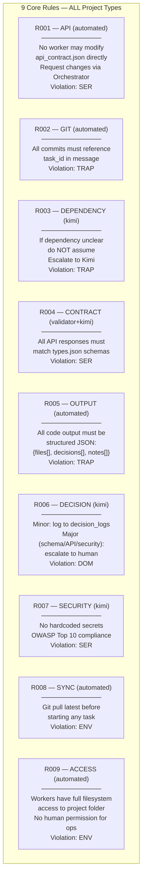

### 1.2 IoT-Specific Rules

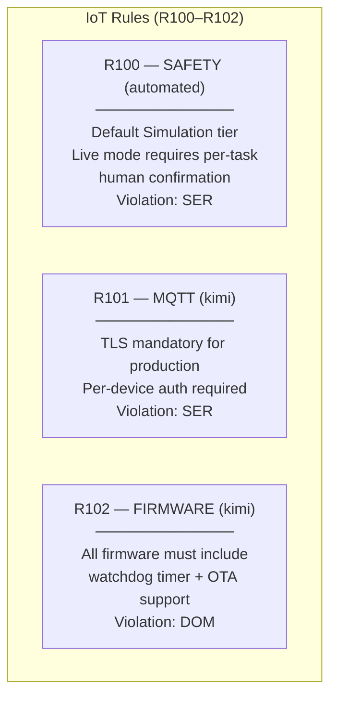

### 1.3 PLM-Specific Rules

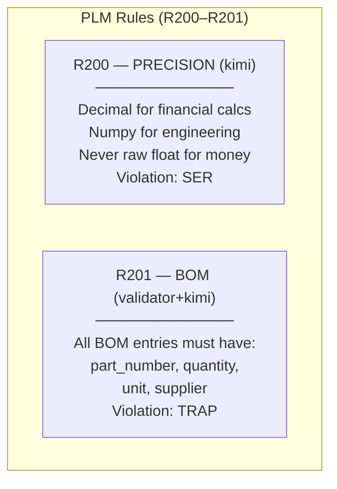

### 1.4 Mobile-Specific Rules

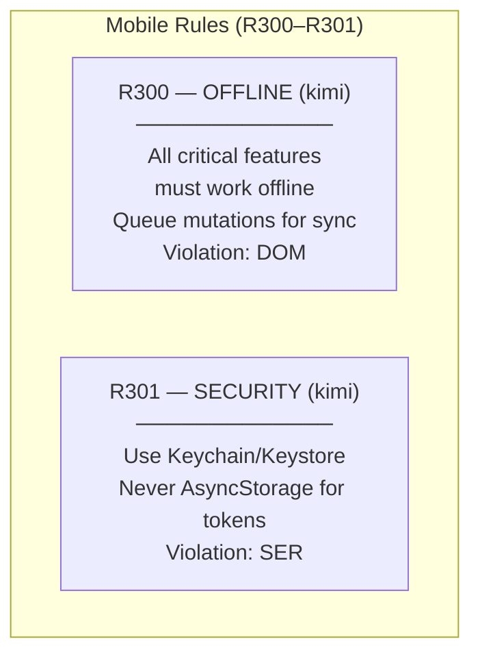

### 1.5 Enforcement Classification

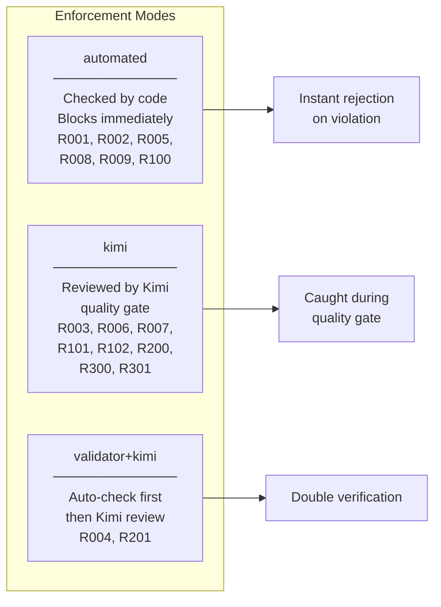

### 1.6 Automated Rule Checking Logic

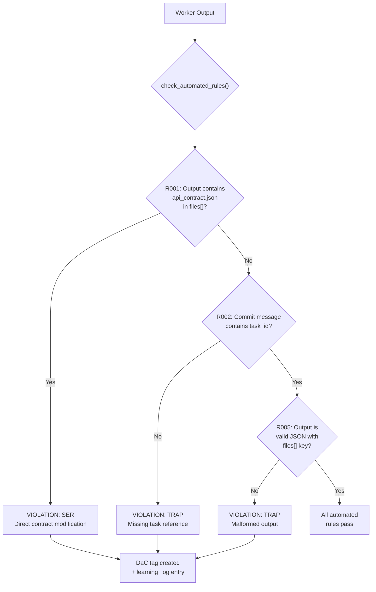

---

## 2. DaC Tag System (EVENT_TAG_MAP)

### 2.1 Tag Types

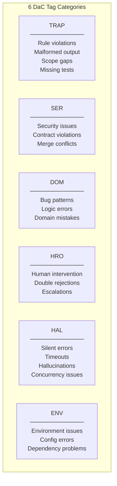

### 2.2 Complete Event → Tag Mapping

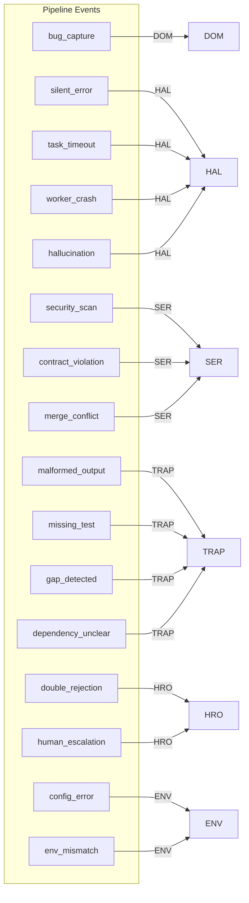

### 2.3 Training Solution Hints (Auto-Generated Per Tag)

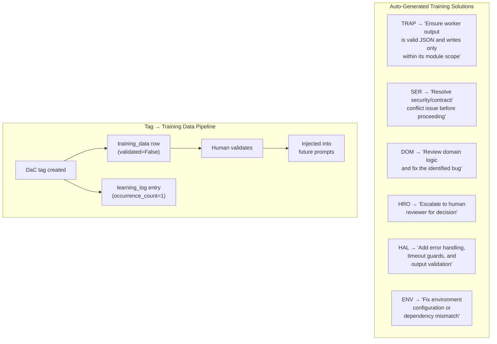

### 2.4 Tag Escalation: Double Rejection → HRO

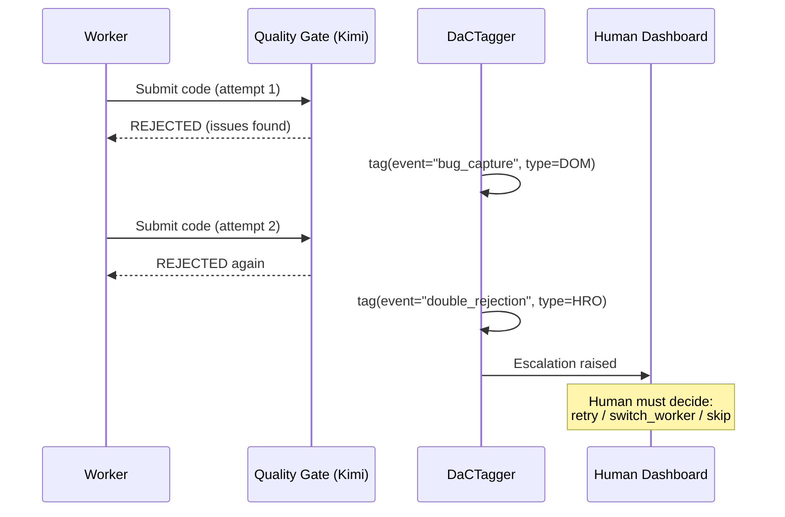

---

## 3. Output Parser Schema

### 3.1 Expected Worker Output Format

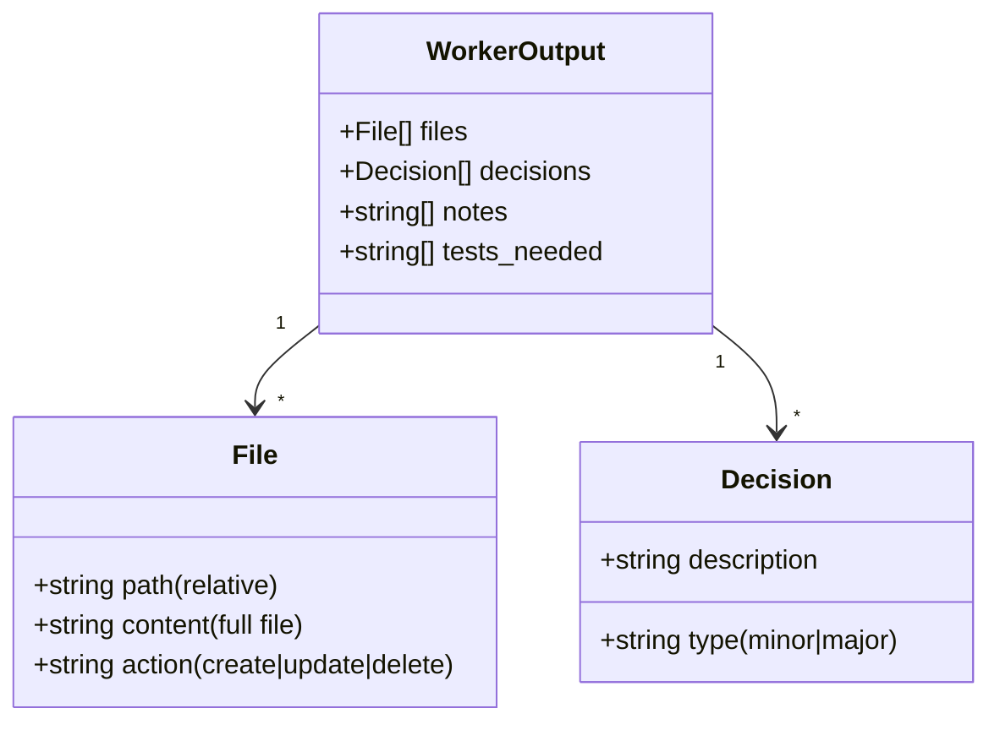

### 3.2 Output Parsing Flow

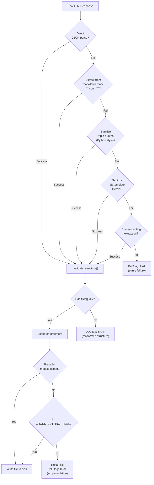

### 3.3 Cross-Cutting Files (Any Task May Touch)

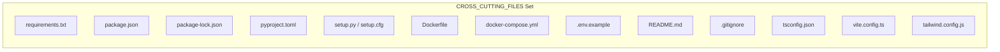

### 3.4 Scope Enforcement Logic

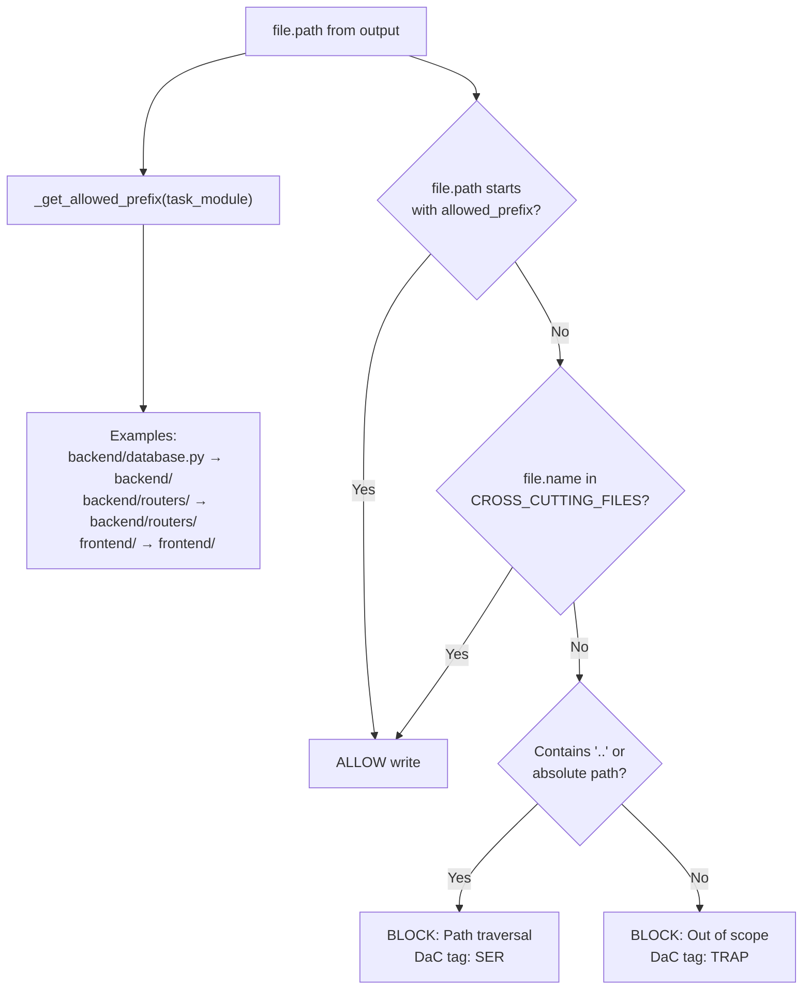

### 3.5 Decision Routing

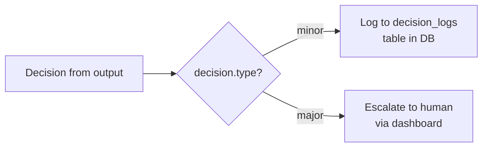

---

## 4. Context Manager — Prompt Assembly

### 4.1 Task Prompt Structure (build_task_prompt)

```mermaid
flowchart TD
    subgraph PROMPT["Worker Task Prompt — 8 Sections"]
        S1["§1 TASK HEADER\n─────────────\ntask_id, module,\nphase, complexity\n+ description"]
        S2["§2 PROTOCOL\n─────────────\nLoaded from protocols/*.md\nFallback: web.md"]
        S3["§3 DaC RULES\n─────────────\nFrom project_rules.json\nFormatted as:\n- [R001] (API): rule text"]
        S3B["§3b KNOWN FAILURE PATTERNS\n─────────────\nHardcoded top recurring bugs:\nTRAP: scope violations\nSER: CORS, JWT, CSRF, secrets\nHRO: async/concurrency\nDOM: FK, nullable, enum\nHAL: localhost, retry, paths"]
        S4["§4 CONTRACTS\n─────────────\napi_contract.json\ndb_schema.sql\ntypes.json\nMarked IMMUTABLE\nDeviation = TRAP rejection"]
        S5A["§5a PHASE FILES\n─────────────\nFiles from earlier tasks\nin same phase (max 30KB)\nPrevents duplicate definitions"]
        S5B["§5b RELEVANT FILES\n─────────────\nExisting code files\n(max 10 files, 50KB each)"]
        S6["§6 PAST LEARNINGS\n─────────────\nFrom learning_log\nFiltered: occurrence ≥ 2\nOR validated=True\nWithin last 90 days"]
        S7["§7 OUTPUT FORMAT\n─────────────\nRequired JSON structure:\n{files[], decisions[],\nnotes[], tests_needed[]}"]
        S8["§8 FILE SCOPE\n─────────────\nAllowed directory prefix\nCross-cutting exceptions\nViolation = TRAP"]
    end

    S1 --> S2 --> S3 --> S3B --> S4 --> S5A --> S5B --> S6 --> S7 --> S8
```

### 4.2 Protocol Loading Fallback Chain

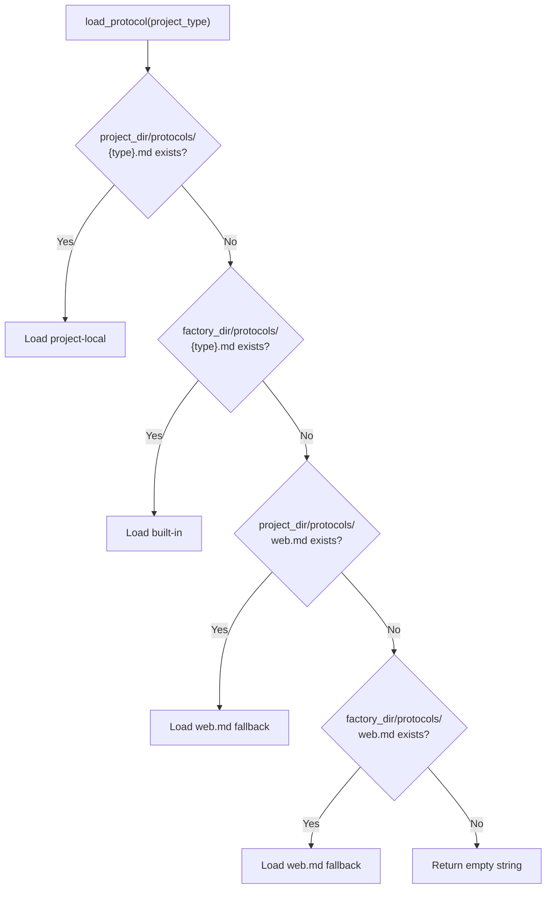

### 4.3 Learning Log Quality Filter

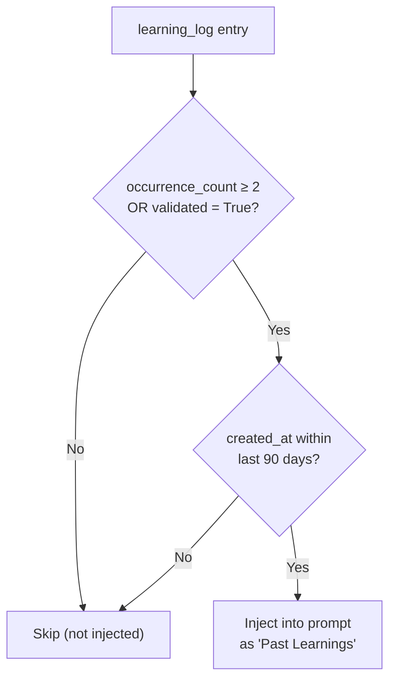

### 4.4 Contract Enforcement Block (Exact Text)

The contracts section injected into every worker prompt includes these exact enforcement rules:

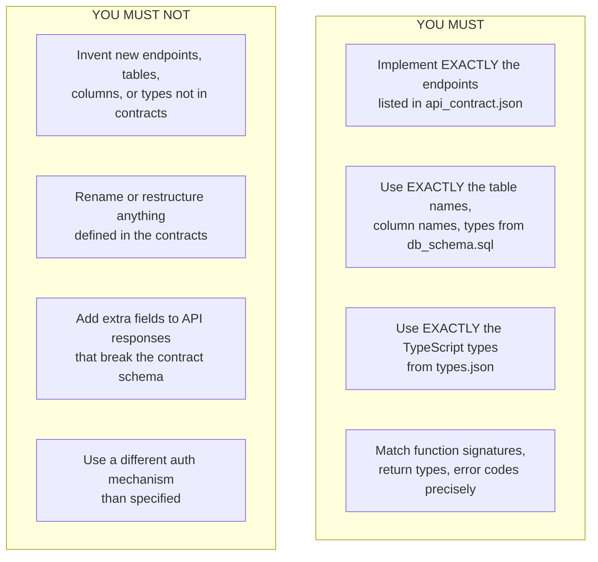

---

## 5. Quality Gate Prompt (build_gate_prompt)

### 5.1 Gate Prompt Structure

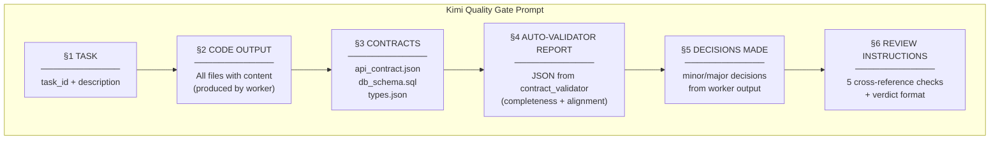

### 5.2 Cross-Reference Checks (Mandatory Before Verdict)

```mermaid
flowchart TD
    subgraph XREF["5 Cross-Reference Checks"]
        X1["1. Python imports\n─────────────\nEvery from X import Y\nmust be stdlib, third-party,\nOR in Code Output files\nMissing local module → REJECT"]
        X2["2. TypeScript imports\n─────────────\nEvery import { Y } from './X'\nmust resolve to file in\nCode Output\nMissing file → REJECT"]
        X3["3. Function/class calls\n─────────────\nEvery called function/class\nmust be defined, imported,\nor built-in\nUndefined references → REJECT"]
        X4["4. Type usage\n─────────────\nTypes must match types.json\nMismatches → list as issues"]
        X5["5. Cross-file consistency\n─────────────\nIf file A imports from B\n(both in Code Output)\nexported names must match\nMismatch → REJECT"]
    end
```

### 5.3 Gate Verdict Schema

```mermaid
classDiagram
    class GateVerdict {
        +string verdict ("APPROVED"|"REJECTED")
        +float confidence (0.0-1.0)
        +string[] issues
        +string[] dac_tags (per issue)
        +string[] suggestions
    }
    note for GateVerdict "APPROVE only if:\n- confidence > 0.9\n- no critical issues\n- all 5 cross-ref checks pass"
```

---

## 6. Orchestrator Brain Decision Trees

### 6.1 Brain Architecture

```mermaid
flowchart TD
    subgraph BRAIN["OrchestratorBrain"]
        THINK["_think(prompt, system)\n─────────────\nPrimary: DeepSeek\nFallback: Qwen\nReturns: parsed JSON dict\nor None on failure"]
        PARSE["_parse_json(text)\n─────────────\n1. Direct JSON.parse\n2. Markdown fence extraction\n3. Brace-counting"]
    end

    THINK --> PARSE

    subgraph METHODS["5 Decision Methods"]
        M1["analyze_rejection()"]
        M2["compose_escalation()"]
        M3["resolve_deadlock()"]
        M4["suggest_worker()"]
        M5["interpret_resolution()"]
    end

    THINK --> M1 & M2 & M3 & M4 & M5

    subgraph FALLBACKS["Every Method Has\nDeterministic Fallback"]
        F_NOTE["If LLM call fails →\nheuristic logic runs\nBrain NEVER blocks pipeline"]
    end

    M1 & M2 & M3 & M4 & M5 --> FALLBACKS
```

### 6.2 analyze_rejection() — Gate Rejection Analysis

```mermaid
flowchart TD
    REJECTION["Quality gate\nrejected task"] --> BRAIN_CALL["Brain analyzes:\n- task description\n- module\n- rejection count\n- gate issues\n- past attempts"]

    BRAIN_CALL --> STRATEGY{"strategy?"}

    STRATEGY -->|"targeted_retry"| RETRY["Prepend retry_guidance\nto worker prompt\nand re-execute same worker"]
    STRATEGY -->|"switch_worker"| SWITCH["Change to different\nworker and retry"]
    STRATEGY -->|"escalate_to_human"| ESCALATE["Show human_summary\non dashboard"]

    subgraph FALLBACK_LOGIC["Deterministic Fallback"]
        FB_CHECK{"rejection_count ≥ 2?"}
        FB_CHECK -->|"Yes"| FB_ESC["escalate_to_human"]
        FB_CHECK -->|"No"| FB_RETRY["targeted_retry\nwith issue list"]
    end

    BRAIN_CALL -.->|"LLM fails"| FALLBACK_LOGIC
```

**Prompt template:**
```
System: You are the reasoning core of an autonomous software factory.
        Analyze gate rejections and recommend the best recovery strategy.
        Always respond with valid JSON.

User:   You are the Orchestrator Brain analyzing a quality-gate rejection.
        TASK: {description}
        MODULE: {module}
        REJECTION #{count}
        ISSUES: {json issues}
        {past attempt history}

        Return JSON: {diagnosis, strategy, retry_guidance, human_summary}
```

**Response schema:**
```mermaid
classDiagram
    class RejectionAnalysis {
        +string diagnosis
        +string strategy ("targeted_retry"|"switch_worker"|"escalate_to_human")
        +string retry_guidance
        +string human_summary
    }
```

### 6.3 compose_escalation() — Rich Escalation

```mermaid
flowchart TD
    REPEATED["Repeated task\nfailures"] --> COMPOSE["Brain composes:\n- all gate issues\n- DaC tags\n- task context"]

    COMPOSE --> OUTPUT["Escalation output:\nsummary + root_cause\n+ 3 options"]

    subgraph OPTIONS["3 Resolution Options"]
        O1["retry_with_different_worker\n'Try deepseek instead of qwen'"]
        O2["simplify_task\n'Break into smaller subtasks'"]
        O3["skip\n'Mark as skipped, move on'"]
    end

    OUTPUT --> OPTIONS
```

**Prompt template:**
```
System: Compose clear, actionable escalations for human operators.

User:   TASK: {description}
        MODULE: {module}
        ALL GATE ISSUES: {json issues}
        DaC TAGS: {json tags}

        Return JSON: {summary, root_cause, options[{label, action, detail}]}
```

### 6.4 resolve_deadlock() — Dependency Deadlock

```mermaid
flowchart TD
    DEADLOCK["All pending tasks\nhave unsatisfied deps"] --> ANALYZE["Brain analyzes\ndependency graph"]

    ANALYZE --> PICK["Picks best task\nto break deadlock"]

    subgraph FALLBACK_DL["Deterministic Fallback"]
        FB_DL["Pick task with\nfewest unsatisfied\ndependencies"]
    end

    ANALYZE -.->|"LLM fails"| FALLBACK_DL
```

**Response schema:**
```mermaid
classDiagram
    class DeadlockResolution {
        +string analysis
        +string resolution ("run_task"|"reorder"|"escalate")
        +string task_to_run
        +string reason
    }
```

### 6.5 suggest_worker() — Smart Worker Routing

```mermaid
flowchart TD
    RETRY["Need to retry\nwith different worker"] --> BRAIN_SW["Brain considers:\n- task complexity\n- previous worker\n- failure history"]

    BRAIN_SW --> PICK_W{"Recommended worker?"}
    PICK_W --> DS["deepseek (16B)\n─────────────\nStrong at complex code"]
    PICK_W --> QW["qwen (7B)\n─────────────\nFast, good at simple code"]

    subgraph FALLBACK_SW["Deterministic Fallback"]
        FB_SW["Swap to other worker:\nif qwen failed → deepseek\nif deepseek failed → qwen"]
    end

    BRAIN_SW -.->|"LLM fails"| FALLBACK_SW
```

### 6.6 interpret_resolution() — Human Decision Translation

```mermaid
flowchart TD
    HUMAN_DEC["Human resolves\nescalation"] --> INTERPRET["Brain interprets\nhuman decision text"]

    INTERPRET --> ACTION{"action?"}
    ACTION -->|"retry_task"| A_RETRY["Re-execute task"]
    ACTION -->|"skip_task"| A_SKIP["Skip and continue"]
    ACTION -->|"modify_prompt"| A_MOD["Prepend prompt_modifier\nto future similar tasks"]
    ACTION -->|"log_learning"| A_LOG["Record learning\nin learning_log"]

    subgraph FALLBACK_IR["Deterministic Fallback"]
        FB_IR["Keyword match:\n'retry/redo/try again' → retry_task\n'skip/ignore/move on' → skip_task\nelse → log_learning"]
    end

    INTERPRET -.->|"LLM fails"| FALLBACK_IR
```

**Response schema:**
```mermaid
classDiagram
    class ResolutionAction {
        +string action ("retry_task"|"skip_task"|"modify_prompt"|"log_learning")
        +string learning
        +string prompt_modifier
    }
```

---

## 7. TDD Pipeline Step Prompts

### 7.1 Testing Ground Truth Rule (Injected Into All Code Steps)

```mermaid
flowchart TD
    subgraph GROUND_TRUTH["TESTING_GROUND_TRUTH_RULE — Injected Into Every Worker"]
        GT1["If tests fail →\nfix SOURCE CODE"]
        GT2["NEVER modify or\nweaken tests"]
        GT3["No assumptions\nNo temporary fixes\nNo test modifications"]
        GT4["No skipping tests\nNo xfail marking\nNo loosening assertions"]
        GT5["Tests define the contract\nImplementation must\nsatisfy the contract"]
    end
```

### 7.2 TDD Step → Worker + DaC Tag Routing

```mermaid
flowchart TD
    subgraph STEP_ROUTING["Step → Worker → Tag Mapping"]
        AC_S["AC (Acceptance Criteria)\n→ Claude (tdd_testing)"]
        RED_S["RED (Write Tests)\n→ Claude (tdd_testing)\n→ pytest must FAIL"]
        GREEN_S["GREEN (Implementation)\n→ Claude (tdd_testing)\n→ pytest must PASS"]
        BC_S["BC (Bug Capture)\n→ flake8 + LLM\n→ Tag: DOM if bugs found"]
        BF_S["BF (Bug Fix)\n→ Claude or DeepSeek\n→ Re-run pytest"]
        SEA_S["SEA (Silent Error)\n→ bandit subset + LLM\n→ Tag: HAL if concurrency issues"]
        DS_S["DS (Security Scan)\n→ bandit + pip-audit + LLM\n→ Tag: SER if violations"]
        OA_S["OA (Output Alignment)\n→ Kimi (tdd_analysis)\n→ Tag: TRAP if gaps"]
        VB_S["VB (Version Bump)\n→ Orchestrator internal"]
        GIT_S["GIT (Atomic Commit)\n→ Delegated to orchestrator"]
        CL_S["CL (Cleanup)\n→ Remove temp artifacts"]
        CCP_S["CCP (Checkpoint)\n→ Save state to DB"]
        AD_S["AD (Dashboard Update)\n→ Broadcast status"]
    end
```

### 7.3 Fast-Track Detection

```mermaid
flowchart TD
    TASK_DESC["Task description"] --> SCAN["Scan for\nfast-track patterns"]

    subgraph PATTERNS["FAST_TRACK_PATTERNS"]
        P1["css, style, color, font, theme"]
        P2["icon, logo, image"]
        P3["copy, text change, label,\nplaceholder, tooltip, typo"]
        P4["config, env, readme,\ncomment, rename, asset"]
    end

    SCAN --> MATCH{"Any pattern\nfound?"}
    MATCH -->|"Yes"| FAST["5-Step Fast-Track\nAC → GREEN → OA → GIT → AD"]
    MATCH -->|"No"| FULL["13-Step Full Pipeline"]
```

---

## 8. Phi3 Summarization & DoC System

### 8.1 Phi3 Summarization Flow

```mermaid
sequenceDiagram
    participant Chat as Chat/Execution Event
    participant Q as Phi3 Queue (max 50)
    participant P3 as Phi3:mini (Ollama)
    participant DB as Database

    Chat->>Q: queue_summary(user_query, llm_response)

    loop Async processing
        Q->>P3: POST /api/generate<br/>temperature: 0.1, num_predict: 256
        P3-->>Q: {summary, decisions[], keywords[]}

        Q->>DB: INSERT chat_summaries<br/>(chat_id, session_id, instance_name,<br/>parent_worker, user_query,<br/>llm_response_summary, keywords,<br/>decisions_made)

        alt persist_full = True
            Q->>DB: UPDATE chat_summaries<br/>SET full_llm_response = ...
            Q->>P3: _update_doc() (DoC merge)
            P3-->>DB: UPDATE context_summaries<br/>(merged DoC, < 3000 words)
        end
    end
```

### 8.2 Summarization Prompt Template

```
Summarize concisely:
USER: {user_query[:500]}
AI: {llm_response[:1000]}

JSON: {"summary":..., "decisions":[...], "keywords":[...]}
```

### 8.3 Document of Context (DoC) Template

```mermaid
flowchart TD
    subgraph DOC_TEMPLATE["DoC Structure (< 3000 words)"]
        DOC1["## DECISIONS MADE\n- [Decision]: [Rationale] (Chat: id)"]
        DOC2["## REQUIREMENTS CAPTURED\n- [Requirement description]"]
        DOC3["## CURRENT STATE\n- Project: [status]\n- Phase: [current phase]\n- Active Tasks: [summary]"]
        DOC4["## KEY CONTEXT\n- [Important context affecting\nfuture decisions]"]
        DOC5["## ACTION ITEMS\n- [ ] Pending action\n- [x] Completed action"]
        DOC6["## SESSION HISTORY\n- One-line summaries\nNewest first, max 20 entries"]
    end
```

### 8.4 DoC Update Prompt Template

```
System: You are a context document maintainer.

Prompt: Update the Document of Context (DoC) by merging new
        information into existing sections. Do NOT rewrite from scratch.

        CURRENT DoC: {current_doc}

        NEW CHAT EXCHANGE:
        USER: {user_query}
        AI SUMMARY: {summary}
        DECISIONS: {decisions}
        KEYWORDS: {keywords}
        CHAT ID: {chat_id}

        RULES:
        - Merge new info into existing sections
        - Remove superseded decisions and completed actions
        - Keep total under 3000 words
        - Output ONLY the updated DoC
```

### 8.5 Execution Summary (queue_execution_summary)

```mermaid
flowchart LR
    EXEC_EVENT["Autonomous\nexecution event"] --> FORMAT["Format:\nuser_query = '[EXEC] task={id}\nphase={N} step={step}\nworker={name}: {preview}'\n\nllm_response = response[:500]"]
    FORMAT --> QUEUE["Queue with:\nsession_id = 'exec_{project_id}'\npersist_full = True\n+ project_id, task_id, phase"]
    QUEUE --> FEEDS["Feeds:\n- DoC (crash recovery)\n- chat_summaries (audit)\n- training_data context"]
```

---

## 9. Known Failure Patterns (Hardcoded in Prompts)

### 9.1 TRAP — Scope Violations (Most Common)

```mermaid
flowchart TD
    subgraph TRAP_PATTERNS["TRAP Failure Patterns"]
        TP1["Writing files outside\nassigned module directory"]
        TP2["Redefining classes/functions\nalready exported by\nanother module"]
        TP3["Shadowing imports:\nimporting a name that\nconflicts with types.json"]
    end
```

### 9.2 SER — Security/Auth Failures

```mermaid
flowchart TD
    subgraph SER_PATTERNS["SER Failure Patterns"]
        SP1["Missing CORS headers or\nhardcoding Allow-Origin: *"]
        SP2["JWT tokens in localStorage\ninstead of httpOnly cookies"]
        SP3["CSRF protection absent\non POST/PUT/DELETE"]
        SP4["Passwords as plaintext or\nweak hash (MD5/SHA1)\ninstead of bcrypt/argon2"]
        SP5["API keys/secrets\nhardcoded in source"]
    end
```

### 9.3 HRO — Async/Concurrency Errors

```mermaid
flowchart TD
    subgraph HRO_PATTERNS["HRO Failure Patterns"]
        HP1["Blocking I/O inside async\nwithout await or to_thread()"]
        HP2["Race conditions from\nshared mutable state"]
        HP3["Missing await on coroutines\n(silently creates objects)"]
    end
```

### 9.4 DOM — Data/Model Integrity

```mermaid
flowchart TD
    subgraph DOM_PATTERNS["DOM Failure Patterns"]
        DP1["Foreign key references to\ntables not yet created"]
        DP2["Nullable columns without\nNone-checks in business logic"]
        DP3["Enum values in code\ndon't match db_schema.sql"]
    end
```

### 9.5 HAL — External Service/Environment

```mermaid
flowchart TD
    subgraph HAL_PATTERNS["HAL Failure Patterns"]
        HP_1["Hardcoded localhost URLs\ninstead of env vars"]
        HP_2["Missing retry/timeout on\nexternal HTTP calls"]
        HP_3["Assuming file paths exist\nwithout Path.exists() check"]
    end
```

---

## 10. Brain System Prompts (Exact Templates)

### 10.1 System Prompts Per Method

```mermaid
flowchart TD
    subgraph SYSTEM_PROMPTS["Brain System Prompts (role prefix for all)"]
        SP_BASE["Base: 'You are the reasoning core\nof an autonomous software factory.'"]

        SP_REJ["analyze_rejection:\n+ 'Analyze gate rejections and\nrecommend the best recovery strategy.\nAlways respond with valid JSON.'"]

        SP_ESC["compose_escalation:\n+ 'Compose clear, actionable\nescalations for human operators.\nAlways respond with valid JSON.'"]

        SP_DL["resolve_deadlock:\n+ 'Resolve dependency deadlocks\nby identifying the best task\nto run first.\nAlways respond with valid JSON.'"]

        SP_WK["suggest_worker:\n+ 'Recommend the best worker\nfor a retry based on\nfailure history.\nAlways respond with valid JSON.'"]

        SP_IR["interpret_resolution:\n+ 'Interpret human decisions and\ntranslate them into actionable\nsystem instructions.\nAlways respond with valid JSON.'"]
    end
```

### 10.2 Worker Available for Brain

```mermaid
flowchart LR
    BRAIN_ROLE["orchestrator_reasoning role"] --> PRIMARY["DeepSeek (16B)\nPrimary"]
    PRIMARY -.->|"fails"| FALLBACK_W["Qwen (7B)\nFallback"]
    FALLBACK_W -.->|"fails"| HEURISTIC["Deterministic\nheuristic logic"]
```
