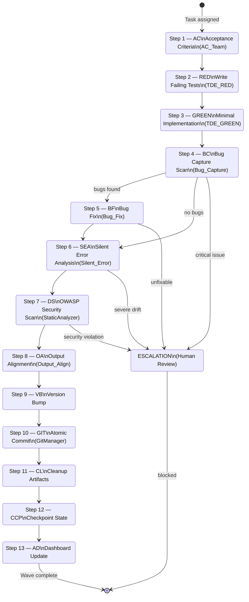
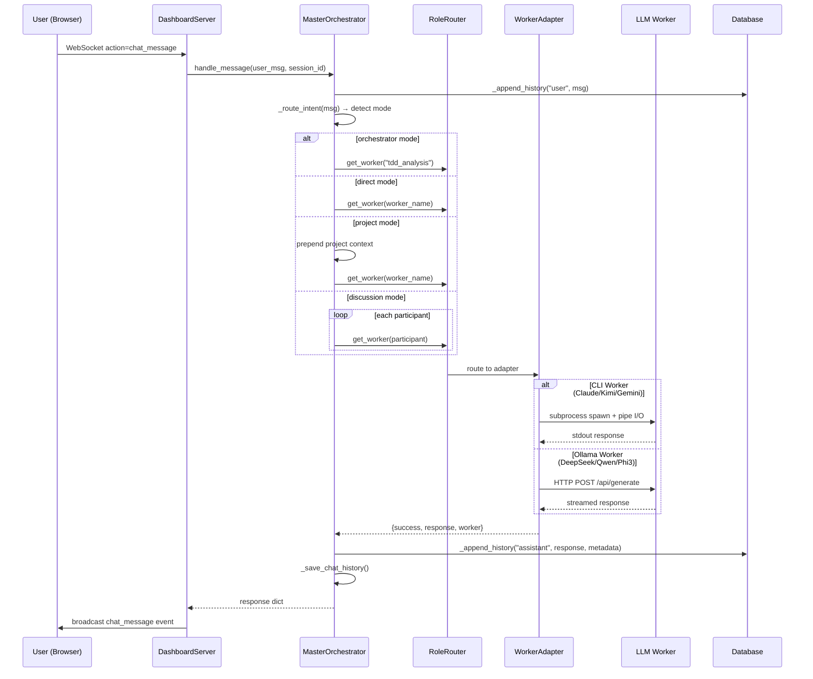
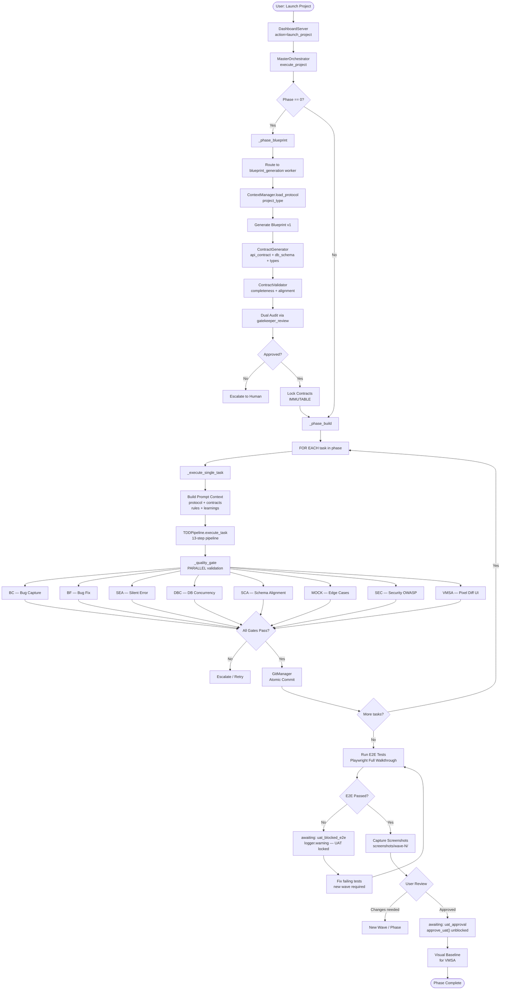
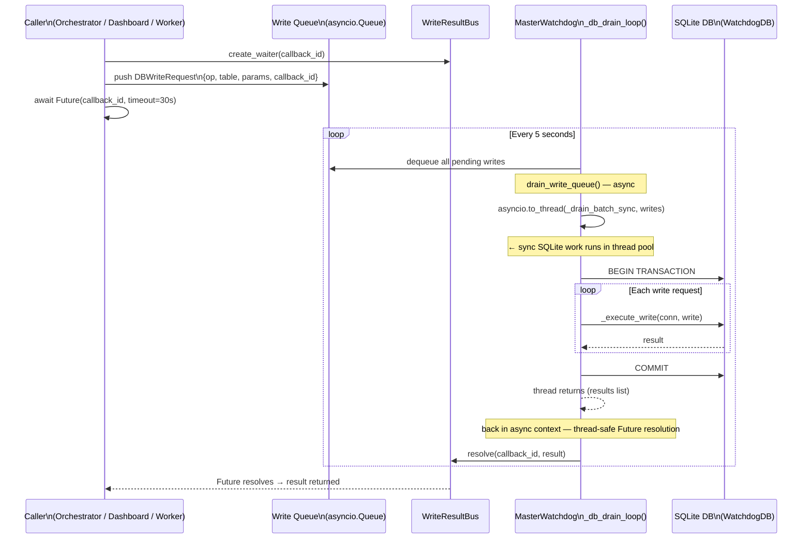
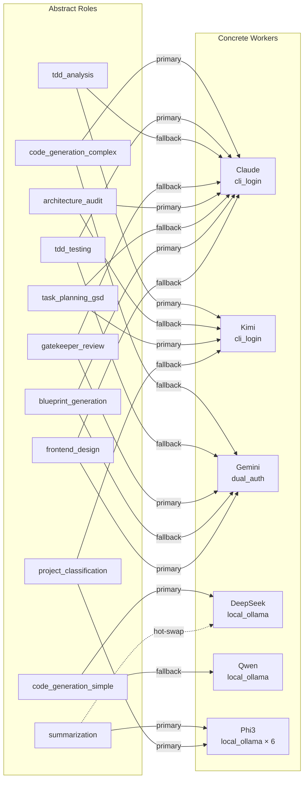
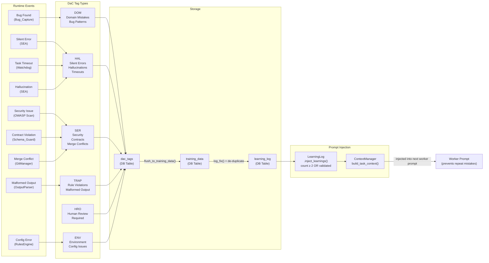
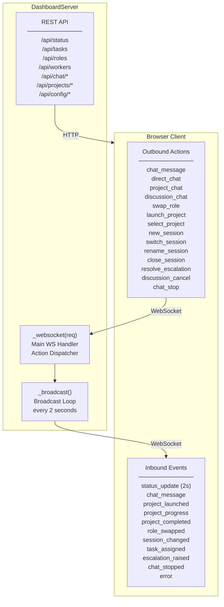
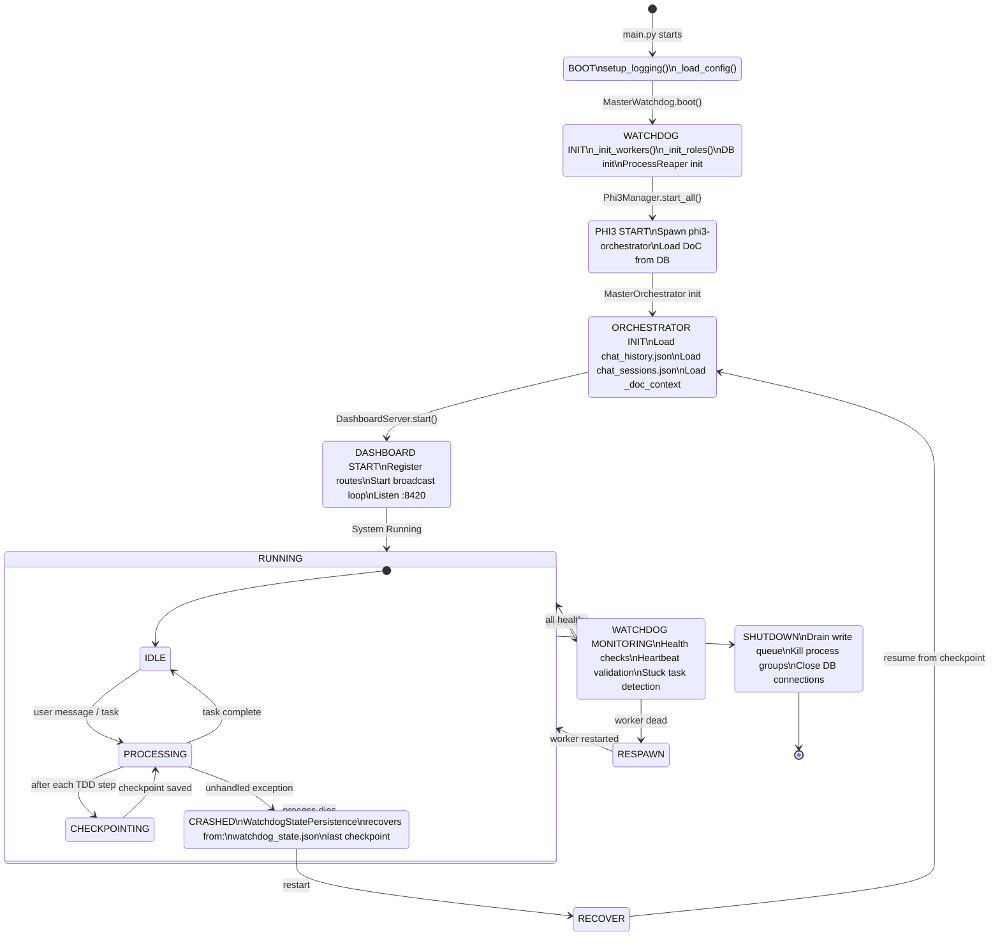

# Autonomous Factory — Diagram as Code (DaC)

## 1. System Architecture Overview

```mermaid
graph TB
    subgraph ENTRY["Entry Point"]
        MAIN["main.py\n─────────────\nsetup_logging()\n_load_config()"]
    end

    subgraph INFRA["Infrastructure Layer"]
        WD["MasterWatchdog\n─────────────\nPID 1 / Sole DB Writer\nProcess Monitor\nTask Allocator\n_db_drain_loop()\n_monitoring_loop()"]
        PR["ProcessReaper\n─────────────\nGhost Process Prevention\nHeartbeat Tracking\nPGID Kill Groups"]
        WSP["WatchdogStatePersistence\n─────────────\nCrash Recovery\nwatchdog_state.json\nHeartbeat File"]
    end

    subgraph DB_LAYER["Database Layer (SQLite WAL)"]
        WDB["WatchdogDB\n─────────────\nWrite-Capable\nSingle Instance\nOwned by Watchdog"]
        RDB["ReadOnlyDB\n─────────────\nDistributed Copies\nOrchestrator · Dashboard\nWorkers"]
        BUS["Message Bus\n─────────────\nasyncio.Queue\nWriteResultBus\nBatched every 5s"]
    end

    subgraph ORCH_LAYER["Orchestration Layer"]
        ORCH["MasterOrchestrator\n─────────────\nCOO — In-Memory\nChat Routing\nProject Execution\nSession Management"]
        PHI3["Phi3Manager\n─────────────\nDoC Scribes\nphi3-orchestrator\nRolling Context\nSummarization"]
        RR["RoleRouter\n─────────────\nRole ↔ Worker Map\nHot-Swap\nFallback Support\nLocal Mode Toggle"]
    end

    subgraph EXECUTION["Autonomous Execution Engine"]
        TDD["TDDPipeline\n─────────────\n13-Step Pipeline\nAC→RED→GREEN→BC→BF\n→SEA→DS→OA→VB→GIT\n→CL→CCP→AD"]
        CM["ContextManager\n─────────────\nProtocol Injection\nContract Loading\nProject Context\nTask Context"]
        CG["ContractGenerator\n─────────────\napi_contract.json\ndb_schema.sql\ntypes.json"]
        CV["ContractValidator\n─────────────\nCompleteness Check\nAlignment Validation\nContract Locking"]
        OP["OutputParser\n─────────────\nJSON Extraction\nFile Writer\nDecision Router"]
        RE["RulesEngine\n─────────────\nDefault Rules (R001-R009)\nProject Rules\nPrompt Injection\nViolation Detection"]
        GM["GitManager\n─────────────\nmain/develop/phase/{N}\nAtomic Commits\nPR Creation\nConflict Detection"]
    end

    subgraph INTELLIGENCE["Intelligence Layer"]
        DT["DaCTagger\n─────────────\nTRAP/SER/DOM\nHRO/HAL/ENV\nAuto-Tagging\nTraining Export"]
        LL["LearningLog\n─────────────\nCross-Project Learning\nDe-duplication\nOccurrence Counting\nPrompt Injection"]
        SA["StaticAnalyzer\n─────────────\nOWASP Scanning\nCode Analysis\nSecurity Findings"]
        CICD["CICDGenerator\n─────────────\nCI/CD Pipeline\nGitHub Actions\nAutomated Builds"]
    end

    subgraph WORKERS["Worker Layer"]
        CLI_W["CLIWorkerAdapter\n─────────────\nSubprocess Spawn\nPipe I/O\nPGID Kill Groups\nCLAUDECODE Strip"]
        OLLAMA_W["OllamaWorkerAdapter\n─────────────\nHTTP POST\nlocalhost:11434\nStream Response\naiohttp Session"]
        subgraph CLI_WORKERS["CLI Workers"]
            CLAUDE["Claude\nclaude CLI"]
            KIMI["Kimi\nkimi CLI"]
            GEMINI["Gemini\ngemini CLI\ndual_auth"]
        end
        subgraph LOCAL_WORKERS["Local Ollama Workers"]
            DEEPSEEK["DeepSeek\ndeepseek-coder-v2:16b"]
            QWEN["Qwen\nqwen2.5-coder:7b"]
            PHI3_W["Phi3\nphi3:mini\n×6 instances"]
        end
    end

    subgraph DASHBOARD["Dashboard Layer"]
        DS["DashboardServer\n─────────────\naiohttp Web Server\nREST API (40+ routes)\nWebSocket Hub\nBroadcast Loop (2s)"]
        UI["Web UI\n─────────────\nhttp://127.0.0.1:8420\nChat Tabs\nRole Management\nProject Controls\nLive Status"]
    end

    subgraph CONFIG["Configuration & Protocols"]
        CFG["factory_config.json\n─────────────\nWorker Configs\nRole Assignments\nWatchdog Settings\nDashboard Settings"]
        PROTO["protocols/\n─────────────\nweb.md\nmobile.md\niot.md\nplm.md\nblueprint_protocol.md"]
    end

    %% Startup Chain
    MAIN -->|"1. boot()"| WD
    MAIN -->|"2. start_all()"| PHI3
    MAIN -->|"3. init"| ORCH
    MAIN -->|"4. start()"| DS

    %% Infrastructure wiring
    WD --> PR
    WD --> WSP
    WD -->|"owns"| WDB
    WD -->|"drains"| BUS
    WDB -->|"read-only copy"| RDB
    RDB -->|"async write requests"| BUS
    BUS -->|"batch execute"| WDB

    %% Orchestration wiring
    ORCH -->|"routes via"| RR
    ORCH -->|"reads"| RDB
    ORCH --> TDD
    ORCH --> CM
    ORCH --> CG
    ORCH --> CV
    ORCH --> OP
    ORCH --> RE
    ORCH --> GM
    ORCH --> DT
    ORCH --> LL
    PHI3 -->|"DoC updates"| ORCH

    %% Role Router → Workers
    RR -->|"get_worker(role)"| CLI_W
    RR -->|"get_worker(role)"| OLLAMA_W
    CLI_W --> CLAUDE
    CLI_W --> KIMI
    CLI_W --> GEMINI
    OLLAMA_W --> DEEPSEEK
    OLLAMA_W --> QWEN
    OLLAMA_W --> PHI3_W

    %% Dashboard connections
    DS -->|"set_orchestrator()"| ORCH
    DS --> RDB
    DS --> RR
    DS -->|"serves"| UI

    %% Config loading
    CFG -->|"loaded by"| MAIN
    PROTO -->|"injected by"| CM

    %% Intelligence connections
    TDD --> DT
    TDD --> LL
    TDD --> SA
    ORCH --> CICD
```

---

## 2. TDD Pipeline (13-Step Wave)

---

## 3. Chat Request Flow

---

## 4. Project Execution Flow

---

## 5. Database Write Flow (Message Bus)

---

## 6. Worker Role Mapping

---

## 7. DaC Tagging & Learning Flow

---

## 8. Dashboard WebSocket API

---

## 9. Process Lifecycle & Crash Recovery

---

## 10. Complete Module Dependency Graph

```mermaid
graph TD
    MAIN["main.py"]

    subgraph ORCH_MOD["orchestration/"]
        MW["master_watchdog.py"]
        MO["master_orchestrator.py"]
        RR2["role_router.py"]
        DB2["database.py"]
        PM["phi3_manager.py"]
        PR2["process_reaper.py"]
        WS2["watchdog_state.py"]
        TDD2["tdd_pipeline.py"]
        CM2["context_manager.py"]
        CG2["contract_generator.py"]
        CV2["contract_validator.py"]
        OP2["output_parser.py"]
        RE2["rules_engine.py"]
        GM2["git_manager.py"]
        DT2["dac_tagger.py"]
        LL2["learning_log.py"]
        SA2["static_analysis.py"]
        CICD2["cicd_generator.py"]
    end

    subgraph WORKERS_MOD["workers/"]
        WA2["adapters.py\nWorkerAdapter\nCLIWorkerAdapter\nOllamaWorkerAdapter"]
        FIG["figma_mcp.py"]
    end

    subgraph DASH_MOD["dashboard/"]
        DS2["dashboard_server.py"]
    end

    subgraph PROTO_MOD["protocols/"]
        WEB["web.md"]
        MOB["mobile.md"]
        IOT["iot.md"]
        PLM["plm.md"]
        BP["blueprint_protocol.md"]
    end

    MAIN --> MW
    MAIN --> PM
    MAIN --> MO
    MAIN --> DS2

    MW --> DB2
    MW --> WA2
    MW --> RR2
    MW --> PR2
    MW --> WS2

    MO --> DB2
    MO --> RR2
    MO --> TDD2
    MO --> CM2
    MO --> CG2
    MO --> CV2
    MO --> OP2
    MO --> RE2
    MO --> GM2
    MO --> DT2
    MO --> LL2
    MO --> CICD2

    TDD2 --> DT2
    TDD2 --> LL2
    TDD2 --> SA2
    TDD2 --> OP2
    TDD2 --> GM2

    PM --> WA2
    RR2 --> WA2
    DS2 --> DB2
    DS2 --> RR2
    CM2 --> WEB
    CM2 --> MOB
    CM2 --> IOT
    CM2 --> PLM
    CM2 --> BP
    CG2 --> WA2
    CV2 --> WA2
```

