# Autonomous Factory — Diagram as Code (DaC)

## Reconstruction Guide

This document + 3 companion files = 100% software reconstruction:

| File | Contains | Purpose |
|------|----------|---------|
| **DaC_diagram.md** (this file) | Architecture, flows, schema, module graph, file map | WHAT the system is |
| **DaC_protocols.md** | Project-type protocols as decision trees | HOW projects are governed |
| **DaC_behavior.md** | Prompt templates, rules, tag mappings, output schemas | HOW components behave |
| **factory_config.json** | Worker configs, role assignments, thresholds, settings | TUNABLE parameters |

---

## 0. File Map — Where Everything Lives

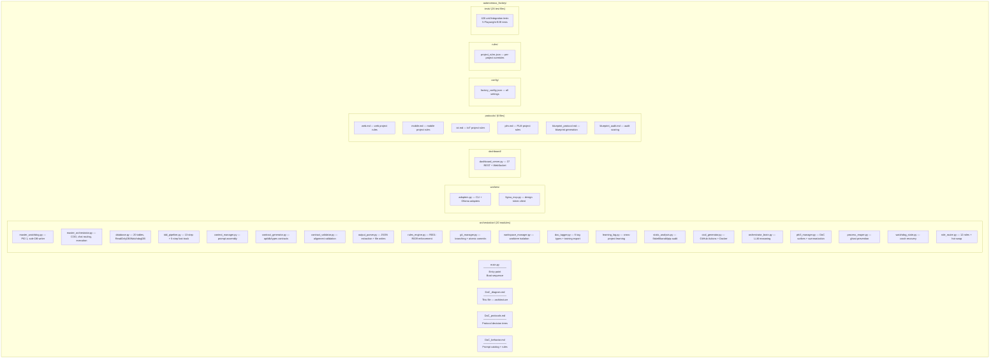

---

## 1. System Architecture Overview

```mermaid
graph TB
    subgraph ENTRY["Entry Point"]
        MAIN["main.py\n─────────────\nsetup_logging()\n_load_config()"]
    end

    subgraph INFRA["Infrastructure Layer"]
        WD["MasterWatchdog\n─────────────\nPID 1 / Sole DB Writer\nProcess Monitor\nTask Allocator\n_db_drain_loop()\n_monitoring_loop()"]
        PR["ProcessReaper\n─────────────\nGhost Process Prevention\nHeartbeat Tracking\nPGID Kill Groups"]
        WSP["WatchdogStatePersistence\n─────────────\nCrash Recovery\nwatchdog_state.json\nHeartbeat File"]
    end

    subgraph DB_LAYER["Database Layer (SQLite WAL — 20 Tables)"]
        WDB["WatchdogDB\n─────────────\nWrite-Capable\nSingle Instance\nOwned by Watchdog\nSCHEMA_VERSION = 3"]
        RDB["ReadOnlyDB\n─────────────\nDistributed Copies\nOrchestrator · Dashboard\nWorkers"]
        BUS["Message Bus\n─────────────\nasyncio.Queue\nWriteResultBus\nBatched every 5s"]
    end

    subgraph ORCH_LAYER["Orchestration Layer"]
        ORCH["MasterOrchestrator\n─────────────\nCOO — In-Memory\nChat Routing (4 modes)\nProject Execution\nSession Management\nWarm/Cold Memory\nDiscussion Panel"]
        PHI3["Phi3Manager\n─────────────\nDoC Scribes\nphi3-orchestrator\nRolling Context\nSummarization\nCold Storage Flush"]
        RR["RoleRouter\n─────────────\nRole ↔ Worker Map\nHot-Swap\nFallback Support\nLocal Test Mode Toggle"]
    end

    subgraph EXECUTION["Autonomous Execution Engine"]
        TDD["TDDPipeline\n─────────────\n13-Step Full Pipeline\nAC→RED→GREEN→BC→BF\n→SEA→DS→OA→VB→GIT\n→CL→CCP→AD\n─────────────\n5-Step Fast-Track\nAC→GREEN→OA→GIT→AD\n(CSS/UI/config only)"]
        CM["ContextManager\n─────────────\nProtocol Injection\nContract Loading\nProject Context\nTask Context"]
        CG["ContractGenerator\n─────────────\napi_contract.json\ndb_schema.sql\ntypes.json"]
        CV["ContractValidator\n─────────────\nCompleteness Check\nAlignment Validation\nContract Locking"]
        OP["OutputParser\n─────────────\nJSON Extraction\nFile Writer\nDecision Router"]
        RE["RulesEngine\n─────────────\nDefault Rules (R001-R009)\nProject Rules\nPrompt Injection\nViolation Detection"]
        GM["GitManager\n─────────────\nmain/develop/phase/{N}\nAtomic Commits\nPR Creation\nConflict Detection"]
        WM["WorkspaceManager\n─────────────\nGit Worktree Isolation\nDomain Routing\nPer-Domain Locks\nSync/Merge/Commit\n.autonomy/ worktrees"]
    end

    subgraph INTELLIGENCE["Intelligence Layer"]
        DT["DaCTagger\n─────────────\nTRAP/SER/DOM\nHRO/HAL/ENV\nAuto-Tagging\nTraining Export"]
        LL["LearningLog\n─────────────\nCross-Project Learning\nDe-duplication\nOccurrence Counting\nPrompt Injection"]
        SA["StaticAnalyzer\n─────────────\nOWASP Scanning\nCode Analysis\nSecurity Findings"]
        CICD["CICDGenerator\n─────────────\nCI/CD Pipeline\nGitHub Actions\nAutomated Builds"]
        BRAIN["OrchestratorBrain\n─────────────\nLLM Reasoning Layer\nGate Rejection Analysis\nDeadlock Resolution\nWorker Routing\nEscalation Composition\nResolution Interpretation"]
    end

    subgraph WORKERS["Worker Layer"]
        CLI_W["CLIWorkerAdapter\n─────────────\nSubprocess Spawn\nPipe I/O\nPGID Kill Groups\nCLAUDECODE Strip"]
        OLLAMA_W["OllamaWorkerAdapter\n─────────────\nHTTP POST\nlocalhost:11434\nStream Response\naiohttp Session"]
        FIGMA["FigmaMCPClient\n─────────────\nDesign Token Fetch\nLayout/Component Specs\nGraceful Fallback\nlocalhost:3845"]
        subgraph CLI_WORKERS["CLI Workers"]
            CLAUDE["Claude\nclaude CLI"]
            KIMI["Kimi\nkimi CLI"]
            GEMINI["Gemini\ngemini CLI\ndual_auth"]
        end
        subgraph LOCAL_WORKERS["Local Ollama Workers"]
            DEEPSEEK["DeepSeek\ndeepseek-coder-v2:16b"]
            QWEN["Qwen\nqwen2.5-coder:7b"]
            PHI3_W["Phi3\nphi3:mini\n×6 instances"]
        end
    end

    subgraph DASHBOARD["Dashboard Layer"]
        DS["DashboardServer\n─────────────\naiohttp Web Server\n37 REST Endpoints\nWebSocket Hub\nBroadcast Loop (2s)\nSession Management API\nChat Search/Archive API"]
        UI["Web UI\n─────────────\nhttp://127.0.0.1:8420\nChat Tabs + Sessions\nRole Management\nProject Controls\nLive Status\nDiscussion Panel"]
    end

    subgraph CONFIG["Configuration & Protocols"]
        CFG["factory_config.json\n─────────────\nWorker Configs\nRole Assignments\nWatchdog Settings\nDashboard Settings\nCost Controls\nLocal Test Mode\nWorkspace Settings"]
        PROTO["protocols/\n─────────────\nweb.md\nmobile.md\niot.md\nplm.md\nblueprint_protocol.md\nblueprint_audit.md"]
    end

    %% Startup Chain
    MAIN -->|"1. boot()"| WD
    MAIN -->|"2. start_all()"| PHI3
    MAIN -->|"3. init"| ORCH
    MAIN -->|"4. start()"| DS

    %% Infrastructure wiring
    WD --> PR
    WD --> WSP
    WD -->|"owns"| WDB
    WD -->|"drains"| BUS
    WDB -->|"read-only copy"| RDB
    RDB -->|"async write requests"| BUS
    BUS -->|"batch execute"| WDB

    %% Orchestration wiring
    ORCH -->|"routes via"| RR
    ORCH -->|"reads"| RDB
    ORCH --> TDD
    ORCH --> CM
    ORCH --> CG
    ORCH --> CV
    ORCH --> OP
    ORCH --> RE
    ORCH --> GM
    ORCH --> WM
    WM -->|"worktree ops"| GM
    ORCH --> DT
    ORCH --> LL
    PHI3 -->|"DoC updates"| ORCH

    %% Role Router → Workers
    RR -->|"get_worker(role)"| CLI_W
    RR -->|"get_worker(role)"| OLLAMA_W
    CLI_W --> CLAUDE
    CLI_W --> KIMI
    CLI_W --> GEMINI
    OLLAMA_W --> DEEPSEEK
    OLLAMA_W --> QWEN
    OLLAMA_W --> PHI3_W
    ORCH -.->|"design tokens"| FIGMA

    %% Dashboard connections
    DS -->|"set_orchestrator()"| ORCH
    DS --> RDB
    DS --> RR
    DS -->|"serves"| UI

    %% Config loading
    CFG -->|"loaded by"| MAIN
    PROTO -->|"injected by"| CM

    %% Intelligence connections
    TDD --> DT
    TDD --> LL
    TDD --> SA
    ORCH --> CICD
    ORCH -->|"reasoning via"| BRAIN
    BRAIN -->|"routes via"| RR
    BRAIN -->|"reads"| RDB
    BRAIN -->|"logs to"| LL
```

---

## 2. TDD Pipeline (13-Step Wave + 5-Step Fast-Track)

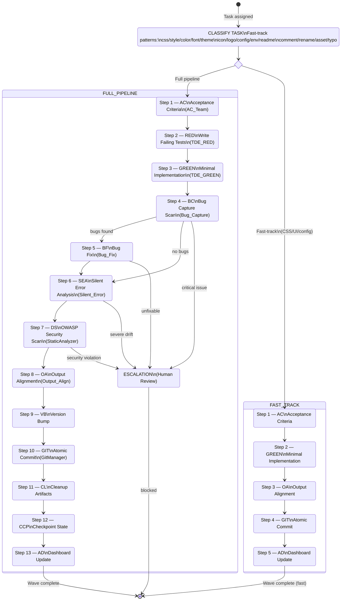

---

## 3. Chat Request Flow

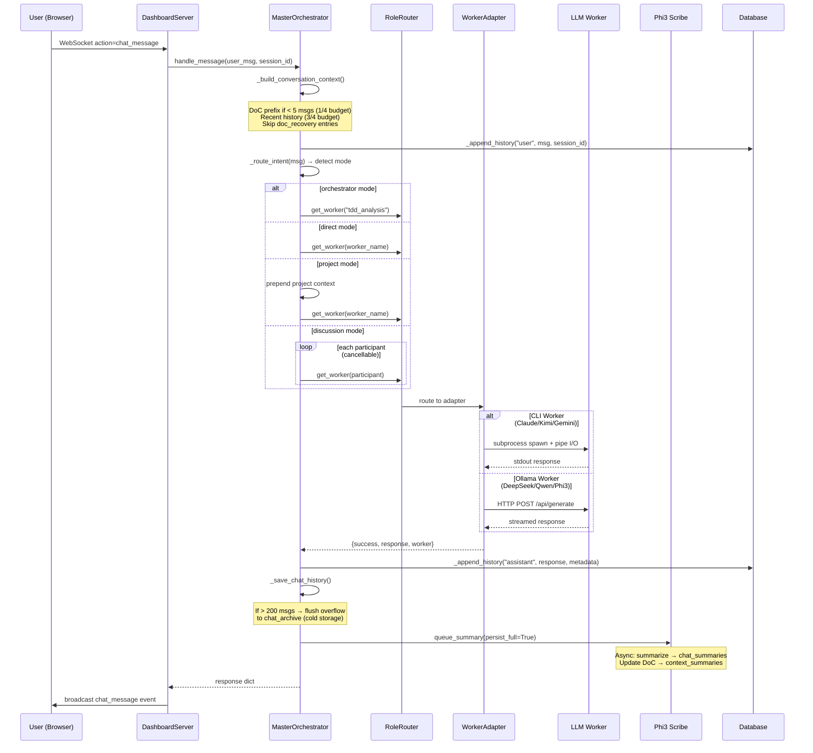

---

## 4. Project Execution Flow

```mermaid
flowchart TD
    START([User: Launch Project]) --> DS_WS[DashboardServer\naction=launch_project]
    DS_WS --> EXEC[MasterOrchestrator\nexecute_project]

    EXEC --> PHASE_CHECK{Phase == 0?}

    PHASE_CHECK -->|Yes| BLUEPRINT[_phase_blueprint]
    BLUEPRINT --> B1[Route to blueprint_generation worker]
    B1 --> B2[ContextManager.load_protocol\nproject_type]
    B2 --> B3[Generate Blueprint v1]
    B3 --> B4[ContractGenerator\napi_contract + db_schema + types]
    B4 --> B5[ContractValidator\ncompleteness + alignment]
    B5 --> B6[Dual Audit via gatekeeper_review]
    B6 --> B7{Approved?}
    B7 -->|No| ESCALATE_BP[Escalate to Human]
    B7 -->|Yes| LOCK[Lock Contracts\nIMMUTABLE]

    PHASE_CHECK -->|No| BUILD[_phase_build]
    LOCK --> WT_SETUP[WorkspaceManager\nsetup_worktrees\n.autonomy/{domain}]
    WT_SETUP --> BUILD

    BUILD --> TASK_LOOP[FOR EACH task in phase]
    TASK_LOOP --> WT_ROUTE[WorkspaceManager\nresolve_worktree\nmodule prefix match]
    WT_ROUTE --> WT_SYNC[sync_from_develop\nmerge develop into worktree]
    WT_SYNC --> SINGLE[_execute_single_task\nin worktree path]

    SINGLE --> CONTEXT[Build Prompt Context\nprotocol + contracts\nrules + learnings]
    CONTEXT --> TDD_RUN[TDDPipeline.execute_task\n13-step pipeline]
    TDD_RUN --> QG[_quality_gate\nPARALLEL validation]

    QG --> BC_G[BC — Bug Capture]
    QG --> BF_G[BF — Bug Fix]
    QG --> SEA_G[SEA — Silent Error]
    QG --> DBC_G[DBC — DB Concurrency]
    QG --> SCA_G[SCA — Schema Alignment]
    QG --> MOCK_G[MOCK — Edge Cases]
    QG --> SEC_G[SEC — Security OWASP]
    QG --> VMSA_G[VMSA — Pixel Diff UI]

    BC_G & BF_G & SEA_G & DBC_G & SCA_G & MOCK_G & SEC_G & VMSA_G --> GATE_RESULT{All Gates Pass?}

    GATE_RESULT -->|No| BRAIN_ANALYZE[OrchestratorBrain\nanalyze_rejection]
    BRAIN_ANALYZE -->|targeted_retry| RETRY_GUIDED[Retry with\nBrain Guidance]
    BRAIN_ANALYZE -->|switch_worker| SWITCH_W[Brain suggests\nalternate worker]
    BRAIN_ANALYZE -->|escalate_to_human| COMPOSE_ESC[brain.compose_escalation\nsummary + root_cause + 3 options]
    RETRY_GUIDED --> QG
    SWITCH_W --> QG
    COMPOSE_ESC --> ESCALATE_TASK[Escalation\nstatus=pending\nWAIT for human]
    ESCALATE_TASK --> BRAIN_INTERP[brain.interpret_resolution\naction + learning + prompt_modifier]
    BRAIN_INTERP -->|retry_task| TASK_LOOP
    BRAIN_INTERP -->|skip_task| NEXT_TASK
    BRAIN_INTERP -->|log_learning| LEARN_LOG[LearningLog\ninjected into future tasks]
    GATE_RESULT -->|Yes| WT_COMMIT[WorkspaceManager\ncommit_in_worktree\ndomain branch]
    WT_COMMIT --> WT_MERGE[merge_to_develop\nworktree → develop\npreserve phase branch]
    WT_MERGE --> NEXT_TASK{More tasks?}
    NEXT_TASK -->|Yes| TASK_LOOP
    NEXT_TASK -->|No| WT_CLEAN[WorkspaceManager\ncleanup_worktrees\nremove .autonomy/]
    WT_CLEAN --> E2E[Run E2E Tests\nPlaywright Full Walkthrough]

    E2E --> E2E_RESULT{E2E Passed?}
    E2E_RESULT -->|No| UAT_BLOCKED["awaiting: uat_blocked_e2e\nlogger.warning — UAT locked"]
    E2E_RESULT -->|Yes| SCREENSHOTS[Capture Screenshots\nscreenshots/wave-N/]

    UAT_BLOCKED --> FIX_E2E[Fix failing tests\nnew wave required]
    FIX_E2E --> E2E

    SCREENSHOTS --> REVIEW{User Review}
    REVIEW -->|Changes needed| NEXT_WAVE[New Wave / Phase]
    REVIEW -->|Approved| UAT_APPROVAL["awaiting: uat_approval\napprove_uat() unblocked"]
    UAT_APPROVAL --> VISUAL_BASE[Visual Baseline\nfor VMSA]
    VISUAL_BASE --> DONE([Phase Complete])
```

---

## 5. Database Write Flow (Message Bus)

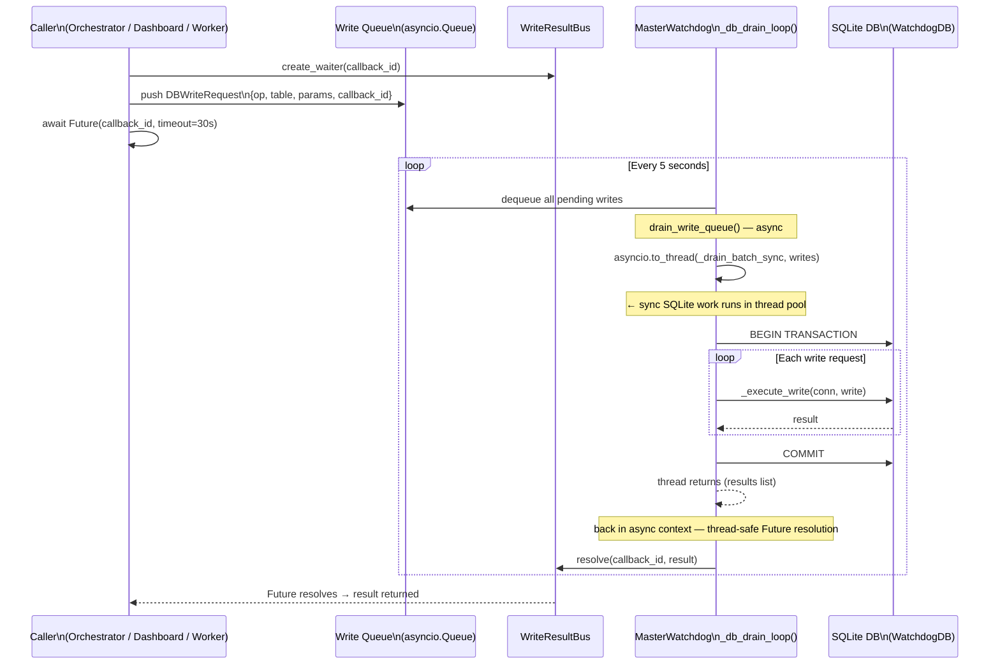

---

## 6. Worker Role Mapping

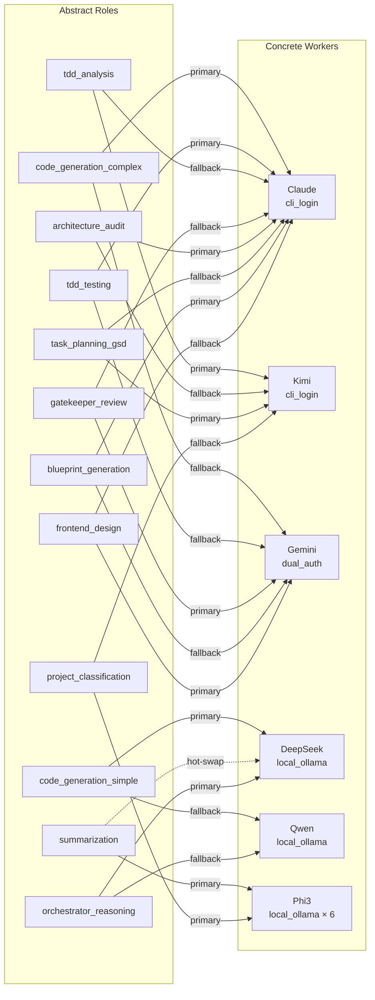

---

## 7. DaC Tagging & Learning Flow

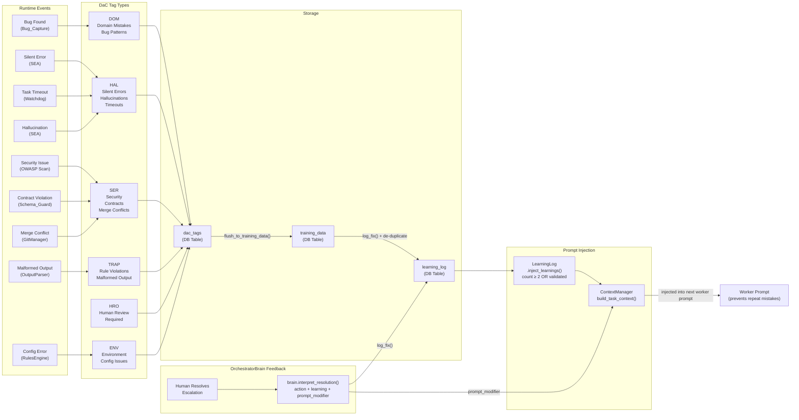

---

## 8. Dashboard WebSocket & REST API

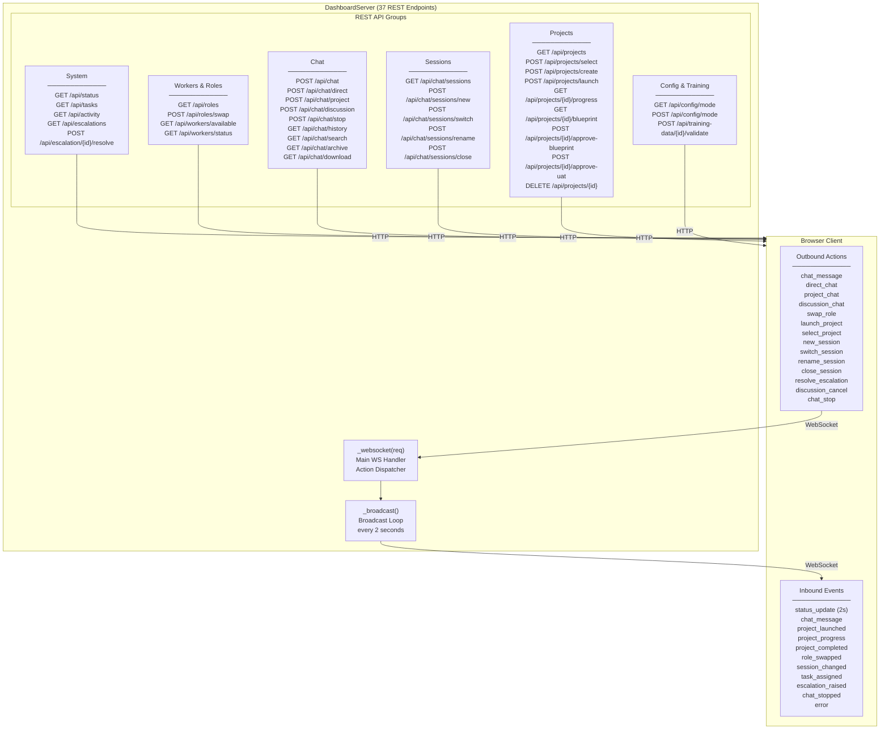

---

## 9. Process Lifecycle & Crash Recovery

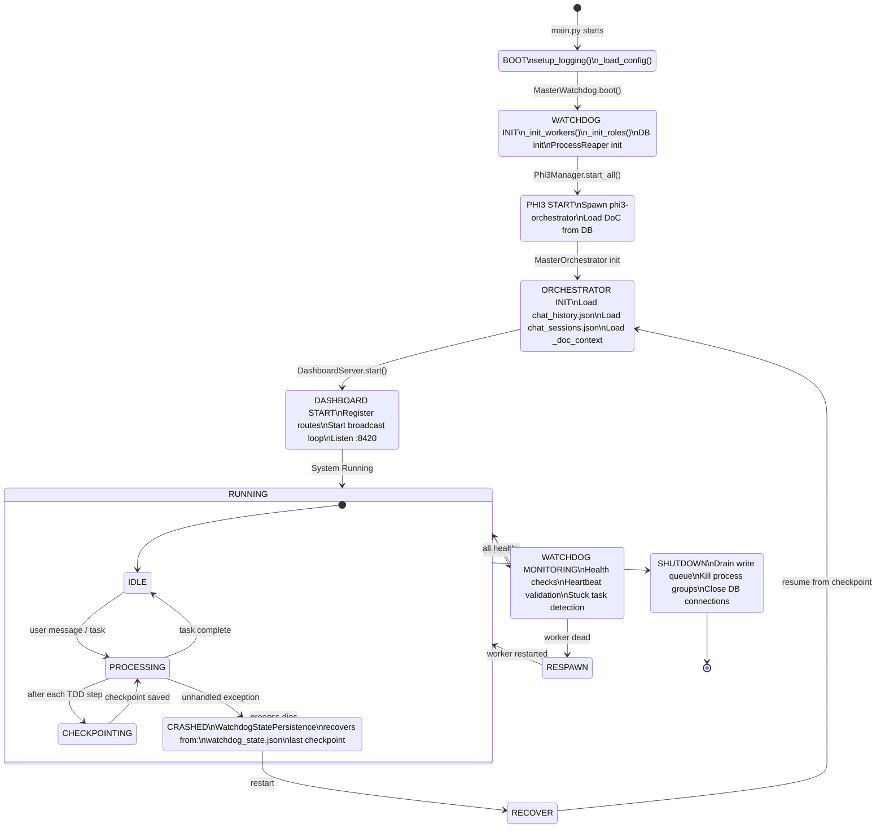

---

## 10. Complete Module Dependency Graph

```mermaid
graph TD
    MAIN["main.py"]

    subgraph ORCH_MOD["orchestration/"]
        MW["master_watchdog.py"]
        MO["master_orchestrator.py"]
        RR2["role_router.py"]
        DB2["database.py"]
        PM["phi3_manager.py"]
        PR2["process_reaper.py"]
        WS2["watchdog_state.py"]
        TDD2["tdd_pipeline.py"]
        CM2["context_manager.py"]
        CG2["contract_generator.py"]
        CV2["contract_validator.py"]
        OP2["output_parser.py"]
        RE2["rules_engine.py"]
        GM2["git_manager.py"]
        DT2["dac_tagger.py"]
        LL2["learning_log.py"]
        SA2["static_analysis.py"]
        CICD2["cicd_generator.py"]
        OB2["orchestrator_brain.py"]
        WM2["workspace_manager.py"]
    end

    subgraph WORKERS_MOD["workers/"]
        WA2["adapters.py\nWorkerAdapter\nCLIWorkerAdapter\nOllamaWorkerAdapter"]
        FIG2["figma_mcp.py\nFigmaMCPClient"]
    end

    subgraph DASH_MOD["dashboard/"]
        DS2["dashboard_server.py"]
    end

    subgraph PROTO_MOD["protocols/"]
        WEB["web.md"]
        MOB["mobile.md"]
        IOT["iot.md"]
        PLM["plm.md"]
        BP["blueprint_protocol.md"]
        BA["blueprint_audit.md"]
    end

    MAIN --> MW
    MAIN --> PM
    MAIN --> MO
    MAIN --> DS2

    MW --> DB2
    MW --> WA2
    MW --> RR2
    MW --> PR2
    MW --> WS2

    MO --> DB2
    MO --> RR2
    MO --> TDD2
    MO --> CM2
    MO --> CG2
    MO --> CV2
    MO --> OP2
    MO --> RE2
    MO --> GM2
    MO --> DT2
    MO --> LL2
    MO --> CICD2
    MO --> OB2
    MO --> WM2
    WM2 --> GM2
    OB2 --> RR2
    OB2 --> DB2
    OB2 --> LL2

    TDD2 --> DT2
    TDD2 --> LL2
    TDD2 --> SA2
    TDD2 --> OP2
    TDD2 --> GM2

    PM --> WA2
    RR2 --> WA2
    DS2 --> DB2
    DS2 --> RR2
    CM2 --> WEB
    CM2 --> MOB
    CM2 --> IOT
    CM2 --> PLM
    CM2 --> BP
    CM2 --> BA
    CG2 --> WA2
    CV2 --> WA2
    MO -.-> FIG2
    DS2 --> MO
```

---

## 11. Database Schema (20 Tables — SCHEMA_VERSION = 3)

```mermaid
erDiagram
    projects ||--o{ tasks : "has"
    projects ||--o{ blueprint_revisions : "versioned by"
    projects ||--o{ phase_completions : "tracks"
    projects ||--o{ training_data : "produces"
    projects ||--o{ decision_logs : "logs"
    tasks ||--o{ checkpoints : "snapshots"
    tasks ||--o{ quality_gates : "validated by"
    tasks ||--o{ commits : "tracked by"
    tasks ||--o{ dac_tags : "tagged by"
    dashboard_state ||--o{ context_summaries : "FK instance_name"

    projects {
        text project_id PK
        text name
        text description
        text status
    }
    tasks {
        text task_id PK
        text project_id FK
        int phase
        text module
        text description
        text status
        text dependencies
    }
    checkpoints {
        int checkpoint_id PK
        text task_id FK
        text step_id
        text state_json
    }
    quality_gates {
        int gate_id PK
        text task_id FK
        text gate_type
        text result
        text details
    }
    commits {
        int commit_id PK
        text task_id FK
        text commit_hash
        text branch
    }
    blueprint_revisions {
        int revision_id PK
        text project_id FK
        int version
        text content
    }
    training_data {
        int training_id PK
        text project_id FK
        text tag_type
        text input_text
        text output_text
    }
    phase_completions {
        int completion_id PK
        text project_id FK
        int phase
        text result
    }
    decision_logs {
        int decision_id PK
        text project_id FK
        text decision_type
        text description
    }
    dashboard_state {
        text instance_name PK
        text status
        text current_task_id FK
        real context_usage_percent
    }
    context_summaries {
        int summary_id PK
        text instance_name FK
        text original_chat_ids
        text summary_text
        int token_count
    }
    chat_summaries {
        text chat_id PK
        text session_id
        text instance_name
        text parent_worker
        text user_query
        text llm_response_summary
        text full_llm_response
        text keywords
        text decisions_made
    }
    chat_archive {
        int archive_id PK
        text session_id
        text role
        text content
        text mode
        text worker
        text project_id
        text original_timestamp
    }
    dac_tags {
        int tag_id PK
        text task_id FK
        text tag_type
        text event
        text context
        text status
    }
    learning_log {
        int log_id PK
        text bug_description
        text root_cause
        text prevention_strategy
        text keywords
        int occurrence_count
        int validated
    }
    worker_health {
        int health_id PK
        text worker_name
        text status
    }
    escalations {
        int escalation_id PK
        text type
        text description
        text status
    }
    cost_tracking {
        int cost_id PK
        text task_id
        text project_id
        text worker
        text operation
        int prompt_tokens
        int completion_tokens
        int total_tokens
        real estimated_cost_usd
        int elapsed_ms
    }
```

---

## 12. Warm/Cold Memory & Session System

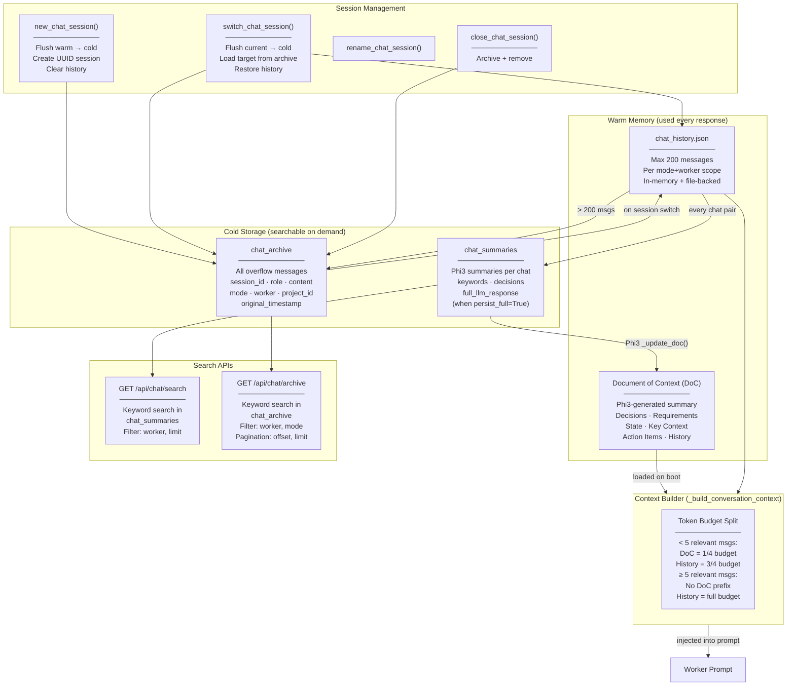

---

## 13. Local Test Mode (E2E Without Token Burn)

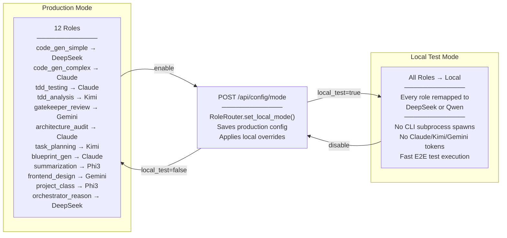
