# Autonomous Factory — Protocol Diagrams as Code

> Companion to `DaC_diagram.md`. Contains all 6 project-type protocols rendered as mermaid decision trees and flow diagrams.
> An AI can reconstruct the exact governance rules from these diagrams alone.

---

## 1. Web/SaaS Protocol

### 1.1 Architecture Decision Tree

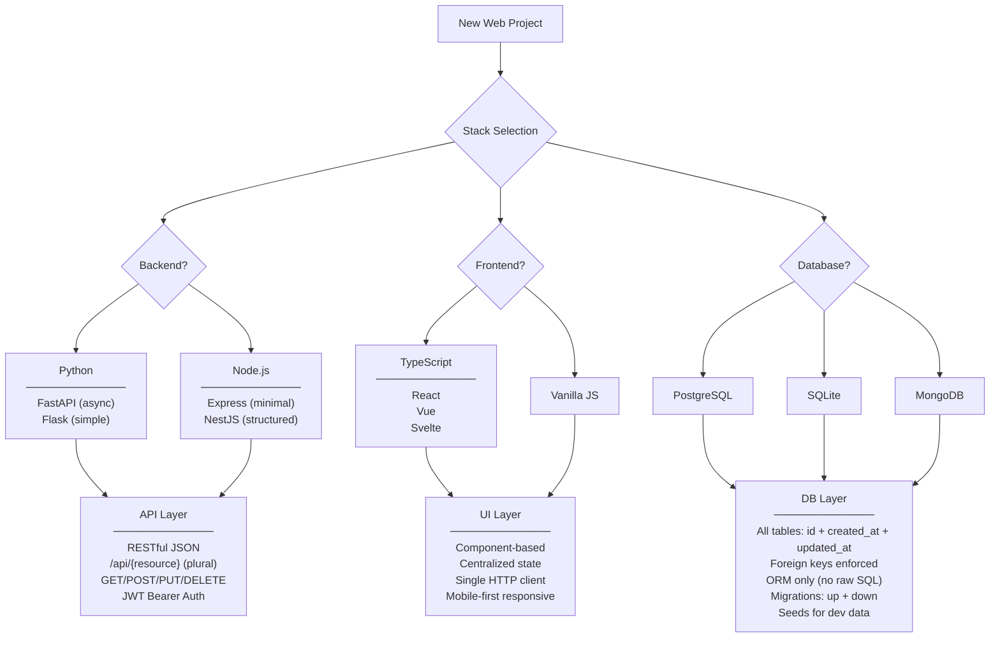

### 1.2 API Response Contract

```mermaid
classDiagram
    class APIResponse {
        +bool success
        +object data
        +string|null error
    }
    class PaginatedRequest {
        +int page = 1
        +int limit = 20
    }
    class PaginatedResponse {
        +bool success
        +array data
        +int total_count
        +int page
        +int limit
    }
    class AuthHeader {
        +string Authorization = "Bearer {JWT}"
    }
    APIResponse <|-- PaginatedResponse
    PaginatedRequest --> PaginatedResponse : produces
    AuthHeader --> APIResponse : required for protected routes
```

### 1.3 Security Enforcement (OWASP Top 10)

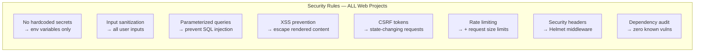

### 1.4 Frontend Rules

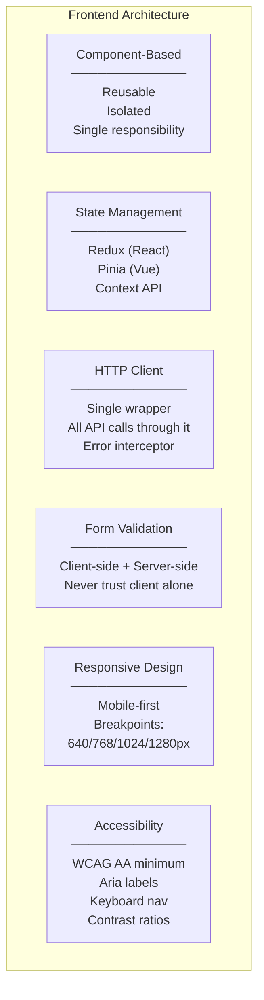

### 1.5 Testing Coverage

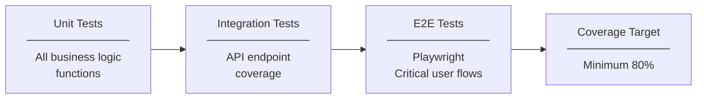

### 1.6 Filesystem Access

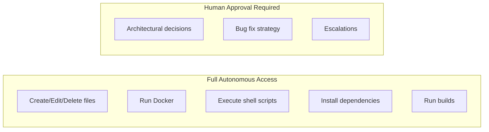

---

## 2. Mobile Protocol

### 2.1 Architecture Decision Tree

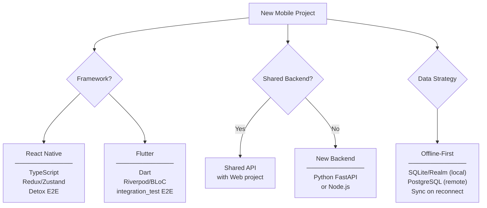

### 2.2 Offline-First Data Flow

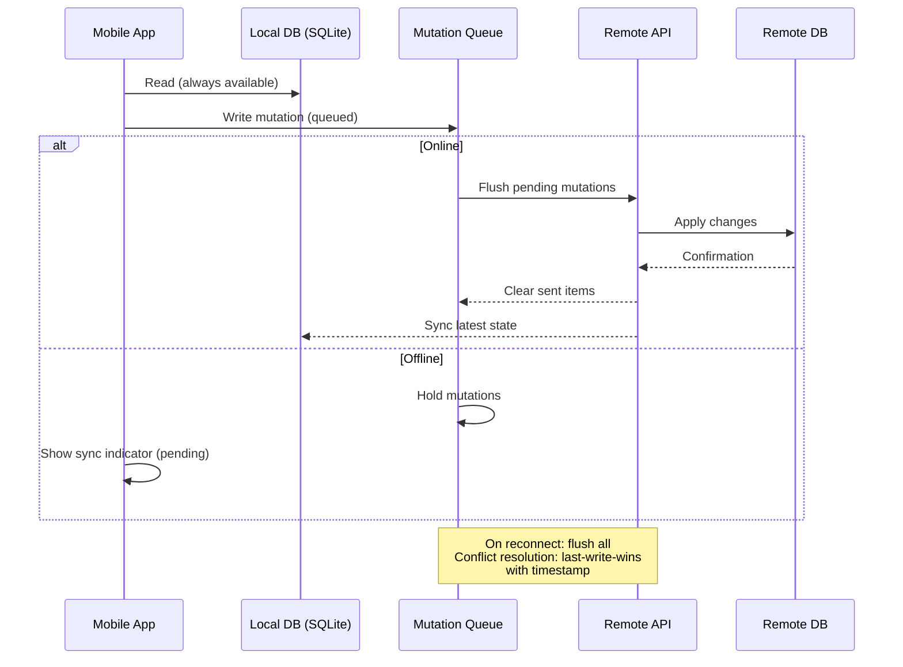

### 2.3 UI/UX Platform Rules

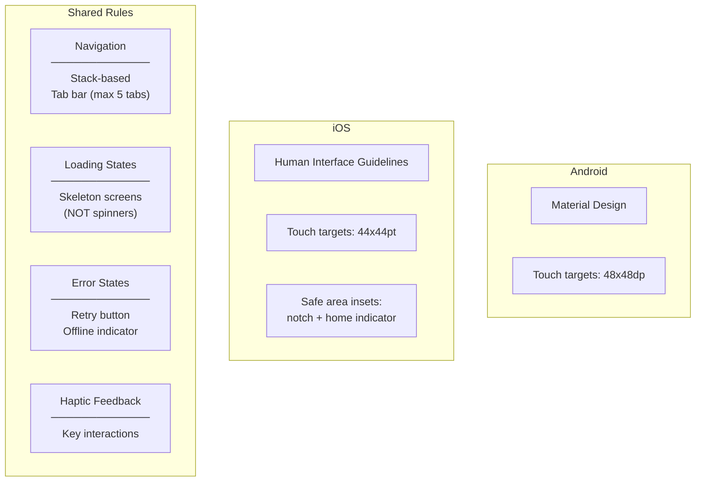

### 2.4 Performance Budgets

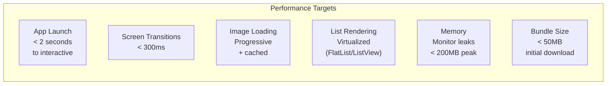

### 2.5 Mobile Security

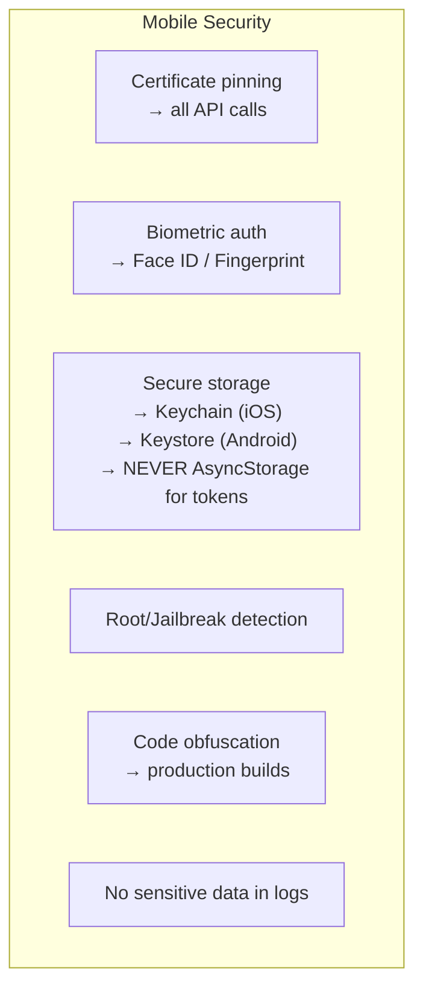

### 2.6 Build & Distribution

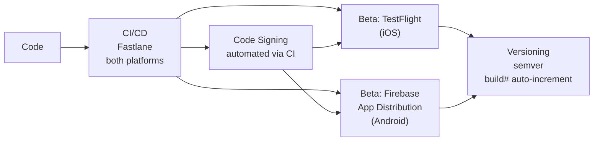

---

## 3. IoT Protocol

### 3.1 Architecture Decision Tree

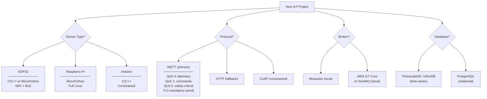

### 3.2 Safety Tier Decision Tree

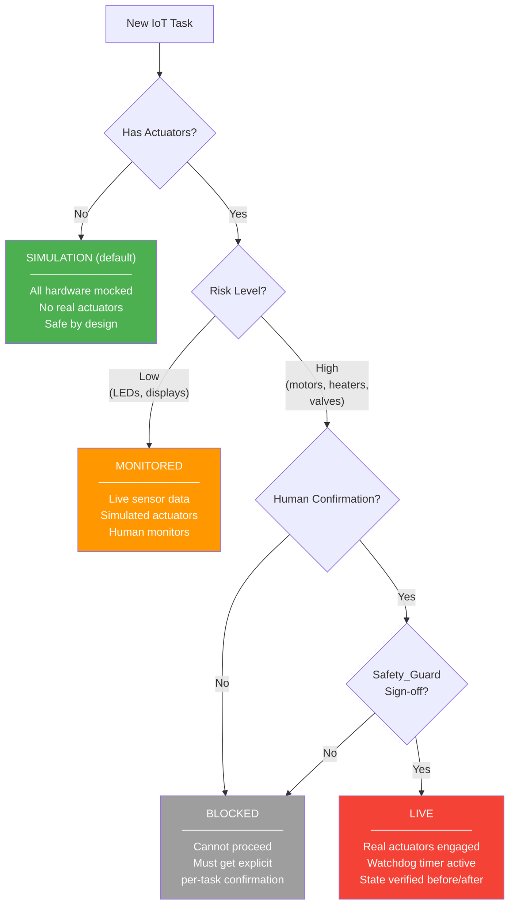

### 3.3 Actuator Lock Protocol

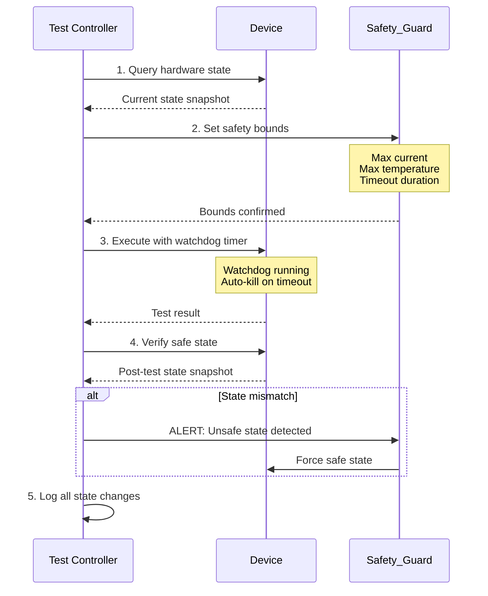

### 3.4 MQTT Topic & QoS Rules

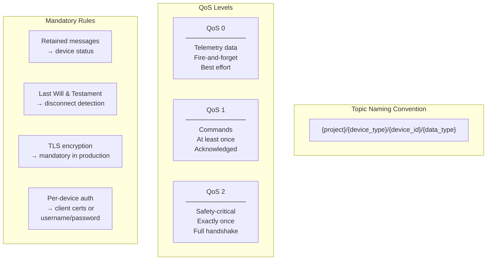

### 3.5 Firmware Rules

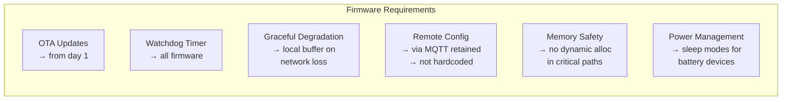

### 3.6 IoT Testing Matrix

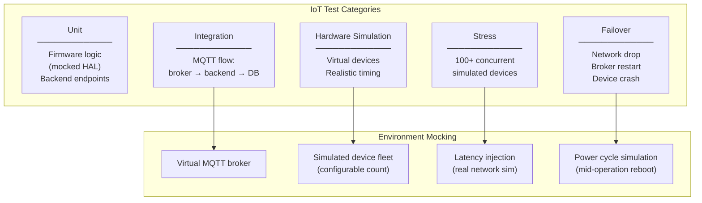

---

## 4. PLM (Product Lifecycle Management) Protocol

### 4.1 Architecture Decision Tree

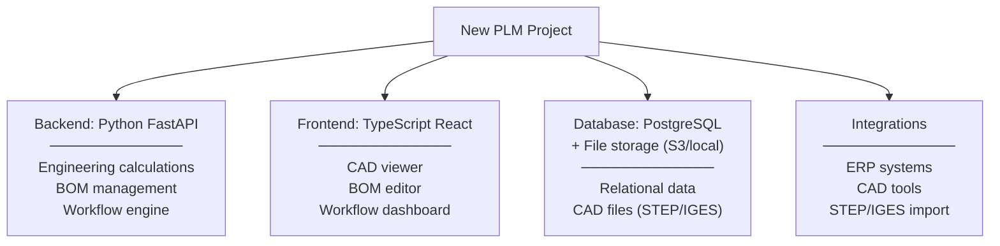

### 4.2 BOM Hierarchy

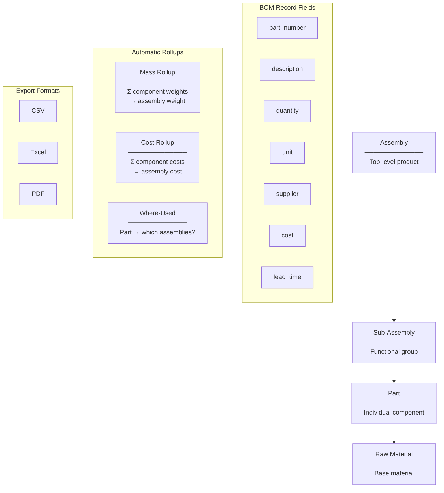

### 4.3 Engineering Calculation Rules

```mermaid
flowchart LR
    subgraph CALC_RULES["Every Calculation Must Include"]
        FORMULA["Formula\n(explicit)"]
        INPUTS["Inputs\n(named + valued)"]
        UNITS["Units\n(SI primary)"]
        RESULT["Result\n(computed)"]
        TOLERANCE["Tolerance\n(±value)"]
    end

    subgraph PRECISION["Precision Standards"]
        DIM["Dimensions\n3 decimal places\n(mm)"]
        ANG["Angles\n2 decimals (deg)\nor 6 decimals (rad)"]
        WEIGHT["Weights\n3 dec (grams)\n6 dec (kg)"]
        CURR["Currency\n2 decimal places\nStored as int cents"]
    end

    subgraph TOL_METHOD["Tolerance Methods"]
        BILATERAL["Bilateral\n±0.01mm"]
        UNILATERAL["Unilateral\n+0.02/-0.00mm"]
        RSS["Stack-up Analysis\nRSS (root sum of\nsquares) default"]
    end
```

### 4.4 Engineering Change Workflow

```mermaid
stateDiagram-v2
    [*] --> ECR: Change identified

    ECR: ECR (Engineering Change Request)
    ECN: ECN (Engineering Change Notice)

    ECR --> IMPACT: Impact analysis
    IMPACT --> REVIEW_ENG: Engineer review
    REVIEW_ENG --> REVIEW_LEAD: Lead review
    REVIEW_LEAD --> REVIEW_MGR: Manager review
    REVIEW_MGR --> ECN: Approved

    REVIEW_ENG --> ECR: Rejected (revise)
    REVIEW_LEAD --> ECR: Rejected (revise)
    REVIEW_MGR --> ECR: Rejected (revise)

    ECN --> EFFECTIVE: Effectivity date set
    EFFECTIVE --> SUPER: Supersedure chain updated
    note right of SUPER: old_part → new_part mapping
    SUPER --> [*]: Change complete
```

### 4.5 CAD Integration

```mermaid
flowchart LR
    CAD_FILE["CAD File\n(STEP/IGES)"] --> IMPORT["Import"]
    IMPORT --> THUMB["Thumbnail Generation\n→ parts catalog"]
    IMPORT --> META["Metadata Extraction\n─────────────\nDimensions\nMaterial\nMass"]
    IMPORT --> VER_SYNC["Version Sync\n─────────────\nCAD version ↔\nBOM revision"]
```

---

## 5. Blueprint Generation Protocol (4 Phases)

### 5.1 Phase Overview

```mermaid
stateDiagram-v2
    [*] --> P0: Project received

    state P0 {
        DETECT: Phase 0 — Domain Detection
        note right of DETECT: Classify project type\nfrom keyword signals
    }

    state P1 {
        RESEARCH: Web Research (15-25 queries)
        MCQ: Generate MCQs (6 categories)
        RESEARCH --> MCQ
    }

    state P2 {
        HUMAN_1: Phase 2 — Human Input
        note right of HUMAN_1: HUMAN OVERRIDE POINT\nAnswer all MCQs\nMay override AI picks
    }

    state P3 {
        GAPS: Gap Detection (min 5 gaps)
        SYNTH: Blueprint Synthesis
        GAPS --> SYNTH
    }

    state P4 {
        VALID: Phase 4 — Validation
        note right of VALID: HUMAN OVERRIDE POINT\nApprove / Revise / Reject
    }

    P0 --> P1
    P1 --> P2
    P2 --> P3
    P3 --> P4
    P4 --> [*]: Approved
    P4 --> P1: Rejected (restart)
    P4 --> P3: Revise (fix sections)
```

### 5.2 Phase 0 — Domain Classification Matrix

```mermaid
flowchart TD
    INPUT["Project Description"] --> SCAN["Keyword Signal Scan"]

    SCAN --> WEB_D["Web Application\n─────────────\nREST, GraphQL, SPA,\nSSR, auth, dashboard\nBase: Medium"]
    SCAN --> API_D["API / Backend\n─────────────\nendpoints, microservices,\nrate-limit, webhook\nBase: Medium"]
    SCAN --> IOT_D["IoT / Embedded\n─────────────\nsensor, actuator, MQTT,\nfirmware, GPIO, edge\nBase: High"]
    SCAN --> ENT_D["Enterprise / PLM\n─────────────\ninventory, ERP, compliance,\nworkflow, audit\nBase: High"]
    SCAN --> ML_D["ML / AI Pipeline\n─────────────\ncamera, CV, model,\ninference, training, GPU\nBase: High"]
    SCAN --> MOB_D["Mobile\n─────────────\niOS, Android, push,\noffline-first, BLE\nBase: Medium"]
    SCAN --> DEVOPS_D["DevOps / Infra\n─────────────\nCI/CD, containers, k8s,\nterraform, monitoring\nBase: Medium"]
    SCAN --> COMM_D["Commerce\n─────────────\ne-commerce, payments,\ncart, catalog, shipping\nBase: Medium-High"]

    SCAN --> HYBRID{"Signals span\n2+ domains?"}
    HYBRID -->|"Yes"| HYBRID_C["Classify as Hybrid\nnote all domains"]

    SCAN --> UPGRADE{"Real-time OR\nRegulatory OR\nHardware?"}
    UPGRADE -->|"Yes"| TIER_UP["Complexity\n+1 tier"]
```

### 5.3 Phase 1 — Web Research Protocol

```mermaid
sequenceDiagram
    participant BP as Blueprint Worker
    participant WEB as Web Search

    rect rgb(66, 133, 244)
        note over BP,WEB: Set 1: Fundamentals (3-5 queries)
        BP->>WEB: "[domain] [framework] production architecture 2025"
        WEB-->>BP: Core tech docs, official guides
    end

    rect rgb(52, 168, 83)
        note over BP,WEB: Set 2: Benchmarks (4-6 queries)
        BP->>WEB: "[tech A] vs [tech B] benchmark latency throughput"
        WEB-->>BP: Performance data, comparisons
    end

    rect rgb(234, 67, 53)
        note over BP,WEB: Set 3: Failures (4-7 queries)
        BP->>WEB: "[tech] production failure post-mortem scaling issues"
        WEB-->>BP: Post-mortems, known pitfalls
    end

    rect rgb(251, 188, 4)
        note over BP,WEB: Set 4: Integration (4-7 queries)
        BP->>WEB: "[tech A] [tech B] integration gotchas migration guide"
        WEB-->>BP: Compatibility, migration paths
    end

    note over BP: Prefer data < 18 months old<br/>Cite sources in recommendations<br/>Flag tech with < 3 sources as "unverified"
```

### 5.4 Phase 1 — MCQ Categories

```mermaid
flowchart TD
    subgraph CAT_A["Category A: Core Problem (2-4 Qs)"]
        A1["Primary use case"]
        A2["Target users"]
        A3["Success metrics\n(MUST be measurable:\nlatency, uptime, throughput)"]
    end

    subgraph CAT_B["Category B: Scope Boundary (3-5 Qs)"]
        B1["In-scope features"]
        B2["OUT-OF-SCOPE items\n(minimum 10 explicit items\neach with 1-line justification)"]
    end

    subgraph CAT_C["Category C: Technology Selection (3-6 Qs)"]
        C1["Language & framework"]
        C2["Database"]
        C3["Infrastructure"]
        C4["Third-party services"]
        C_NOTE["MUST include benchmark data\n(latency, memory, cost)\nMUST include 1 conservative +\n1 modern option"]
    end

    subgraph CAT_D["Category D: Security (2-3 Qs)"]
        D1["Auth method"]
        D2["Encryption at-rest + in-transit"]
        D3["Secrets management"]
    end

    subgraph CAT_E["Category E: UX & Testing (2-3 Qs)"]
        E1["Test coverage target"]
        E2["E2E scope"]
        E3["Performance budget"]
    end

    subgraph CAT_F["Category F: Operations (2-3 Qs)"]
        F1["Deployment strategy"]
        F2["Rollback plan"]
        F3["Alerting thresholds"]
    end
```

### 5.5 MCQ Format Template

```mermaid
classDiagram
    class MCQ {
        +string category_letter
        +int number
        +string title
        +string question
        +Option[] options
        +string ai_recommendation
        +string reasoning (2-3 sentences with data)
    }
    class Option {
        +string letter (A/B/C)
        +string description
        +string tradeoff (pro/con summary)
    }
    class HumanResponse {
        +string selected_option
        +bool overrode_ai
        +string override_rationale
        +string free_text_additions
    }
    MCQ "1" --> "3+" Option
    MCQ "1" --> "1" HumanResponse
```

### 5.6 Phase 3 — Gap Detection (Minimum 5 Required)

```mermaid
flowchart TD
    ANSWERS["All MCQ Answers"] --> GAP_SCAN["Gap Detection Scan"]

    GAP_SCAN --> G1["Missing error handling strategy"]
    GAP_SCAN --> G2["Undefined data migration path"]
    GAP_SCAN --> G3["No rollback procedure specified"]
    GAP_SCAN --> G4["Unclear ownership boundaries"]
    GAP_SCAN --> G5["Missing rate limits / resource caps"]
    GAP_SCAN --> G6["No offline / degraded-mode behavior"]
    GAP_SCAN --> G7["Unaddressed regulatory / compliance"]
    GAP_SCAN --> G8["Missing monitoring / observability"]
    GAP_SCAN --> G9["Undefined inter-service contracts"]
    GAP_SCAN --> G10["No capacity planning / scaling triggers"]

    G1 & G2 & G3 & G4 & G5 & G6 & G7 & G8 & G9 & G10 --> PRESENT["Present gaps to human\nwith recommended default"]
    PRESENT --> CONFIRM{"Human confirms\nor overrides"}
    CONFIRM --> BLUEPRINT["Proceed to blueprint synthesis"]
```

### 5.7 Blueprint Output Structure

```mermaid
flowchart TD
    subgraph BLUEPRINT["Blueprint Document Structure"]
        META["Metadata\n─────────────\nDomain · Complexity\nTimestamp\nHuman override count"]
        SEC1["§1 Problem Statement\n(3-5 sentences)"]
        SEC2["§2 Success Metrics\n(table with numbers)"]
        SEC3["§3 Scope\n─────────────\nIn-scope (bullets)\nOut-of-scope (10+ items)"]
        SEC4["§4 Architecture\n─────────────\nSystem overview\nTech stack (with benchmarks)\nData model\nAPI contracts"]
        SEC5["§5 Security Plan\n(auth, encryption, secrets)"]
        SEC6["§6 Testing Strategy\n(coverage, E2E, perf budget)"]
        SEC7["§7 Operations\n(deploy, monitor, scale)"]
        SEC8["§8 Timeline\n(phases + milestones)"]
        SEC9["§9 Risks & Mitigations\n(table: risk, prob, impact, fix)"]
        SEC10["§10 Gaps Addressed\n(from gap detection)"]
    end

    META --> SEC1 --> SEC2 --> SEC3 --> SEC4 --> SEC5 --> SEC6 --> SEC7 --> SEC8 --> SEC9 --> SEC10
```

---

## 6. Blueprint Audit Protocol (Quality Scoring)

### 6.1 Scoring Formula

```mermaid
flowchart TD
    subgraph FORMULA["Final Score = weighted average"]
        PRAC["Practicality\n× 0.35"]
        COMP["Completeness\n× 0.25"]
        CLAR["Clarity\n× 0.20"]
        FEAS["Feasibility\n× 0.15"]
        INNO["Innovation\n× 0.05"]
    end

    PRAC & COMP & CLAR & FEAS & INNO --> SCORE["Weighted Total\n(0-100)"]

    SCORE --> G90{"≥ 90?"}
    G90 -->|"Yes"| PROD["Production-Grade\n→ Approve, proceed"]
    G90 -->|"No"| G75{"≥ 75?"}
    G75 -->|"Yes"| STRONG["Strong\n→ Approve with\nminor revisions"]
    G75 -->|"No"| G60{"≥ 60?"}
    G60 -->|"Yes"| ADEQUATE["Adequate\n→ Revise flagged\nsections"]
    G60 -->|"No"| G45{"≥ 45?"}
    G45 -->|"Yes"| WEAK["Weak\n→ Return to\nblueprint gen"]
    G45 -->|"No"| REJECT["Reject\n→ Restart from\nPhase 1"]

    style PROD fill:#4CAF50,color:#fff
    style STRONG fill:#8BC34A,color:#fff
    style ADEQUATE fill:#FF9800,color:#fff
    style WEAK fill:#FF5722,color:#fff
    style REJECT fill:#f44336,color:#fff
```

### 6.2 Practicality Sub-Criteria (weight: 0.35)

```mermaid
flowchart TD
    subgraph PRAC_SUB["Practicality — 5 sub-criteria (averaged)"]
        P1a["1a. Technology Realism\n─────────────\nProduction-proven tech?\nBenchmarks cited?\n🔴 Bleeding-edge without fallback\n🟢 Conservative + upgrade path"]
        P1b["1b. Timeline Feasibility\n─────────────\nIncludes integration + testing?\n15-20% buffer for unknowns?\n🔴 'MVP in 2 weeks' with 5+ integrations\n🟢 Phased with go/no-go gates"]
        P1c["1c. Scope Discipline\n─────────────\n10+ out-of-scope items?\nAchievable by team in timeline?\n🔴 Creep disguised as nice-to-have\n🟢 Ruthless prioritization"]
        P1d["1d. Cost Realism\n─────────────\nSpecific tiers/SKUs?\nThird-party costs included?\n🔴 'Costs TBD'\n🟢 Monthly burn + scaling projection"]
        P1e["1e. Team Capability Match\n─────────────\nStack matches team skills?\nRamp-up time if new tech?\n🔴 Stack nobody has shipped\n🟢 Experience aligned, 1 new component max"]
    end
```

### 6.3 Completeness Sub-Criteria (weight: 0.25)

```mermaid
flowchart TD
    subgraph COMP_SUB["Completeness"]
        C2a["2a. Critical Sections Present\n─────────────\nALL must exist:\nProblem · Metrics · Scope\nArchitecture · Data Model\nAPI Contracts · Security\nTesting · Deploy · Monitor\nTimeline · Risks\n─────────────\nMissing any → cap at 40"]
        C2b["2b. Domain Intelligence\n─────────────\nDomain-specific research?\nKnown failure modes addressed?\n🔴 Generic architecture\n🟢 Domain constraints acknowledged"]
        C2c["2c. Edge Cases & Error Handling\n─────────────\nFailure modes per integration?\nDegraded-mode strategy?\nRate limits + timeouts + retries?\n🔴 Happy-path only\n🟢 Error taxonomy + recovery actions"]
    end
```

### 6.4 Clarity Sub-Criteria (weight: 0.20)

```mermaid
flowchart TD
    subgraph CLAR_SUB["Clarity"]
        C3a["3a. Decision Clarity\n─────────────\nEvery tech choice justified?\nTrade-offs stated?\n🔴 'We will use PostgreSQL' (no why)\n🟢 'PostgreSQL because [reason + benchmark]'"]
        C3b["3b. API Contract Specificity\n─────────────\nMethod + path + request + response?\nError responses documented?\n🔴 'CRUD endpoints' (no detail)\n🟢 Full endpoint table + schemas"]
        C3c["3c. Data Model Precision\n─────────────\nEntities + relationships + fields?\nIndexes + constraints + migrations?\n🔴 Entity list, no relationships\n🟢 Schema-level with cardinality"]
    end
```

### 6.5 Feasibility Sub-Criteria (weight: 0.15)

```mermaid
flowchart TD
    subgraph FEAS_SUB["Feasibility"]
        F4a["4a. Resource Constraints\n─────────────\nCompute/memory/storage limits?\nScaling triggers defined?\n🔴 'Will scale as needed'\n🟢 'At 1000 RPS add replica,\nat 5000 RPS shard by tenant'"]
        F4b["4b. Dependency Risk\n─────────────\nExternal deps listed + assessed?\nFallback for single-vendor?\n🔴 Critical path on beta API\n🟢 Dependency matrix + alternatives"]
        F4c["4c. Technical Debt\n─────────────\nShortcuts documented?\nPost-launch plan?\n🔴 No mention of trade-offs\n🟢 Explicit debt register + timeline"]
    end
```

### 6.6 Spaceship Disqualifiers (Auto-cap at 60)

```mermaid
flowchart TD
    AUDIT["Audit Scan"] --> DQ_CHECK{"Any disqualifier\ntriggered?"}

    DQ_CHECK -->|"Yes"| CAP["Score CAPPED at 60\n(max grade: Adequate)"]
    DQ_CHECK -->|"No"| PASS["Score uncapped\nuse weighted formula"]

    subgraph DISQUALIFIERS["8 Automatic Disqualifiers"]
        DQ1["Unbounded Scope\n< 10 out-of-scope items"]
        DQ2["Fantasy Timeline\n< 50% of industry benchmark"]
        DQ3["Unproven Core Dependency\nNo production track record"]
        DQ4["Missing Security Section\nNo auth/encryption/secrets"]
        DQ5["No Error Handling\nHappy-path only"]
        DQ6["Infinite Scaling Assumption\n'Handle any load'"]
        DQ7["Zero Cost Analysis\nNo cost estimates"]
        DQ8["No Testing Strategy\nNo coverage/E2E/perf targets"]
    end

    DQ1 & DQ2 & DQ3 & DQ4 & DQ5 & DQ6 & DQ7 & DQ8 --> DQ_CHECK

    style CAP fill:#f44336,color:#fff
    style PASS fill:#4CAF50,color:#fff
```

### 6.7 Core Philosophy

```mermaid
flowchart LR
    subgraph GOOD["SPORTS CAR ✓"]
        G_FAST["Fast & focused"]
        G_KNOWN["Known technology"]
        G_REAL["Realistic resources"]
        G_PRAG["Pragmatic constraints"]
    end

    subgraph BAD["SPACESHIP ✗"]
        B_OVER["Over-engineered"]
        B_SPEC["Speculative tech"]
        B_UNLIM["Unlimited budget assumed"]
        B_AMBIT["Ambition without evidence"]
    end

    GOOD -->|"Reward"| SCORE_UP["Higher Score"]
    BAD -->|"Penalize"| SCORE_DOWN["Lower Score"]
```

### 6.8 Audit Output Structure

```mermaid
classDiagram
    class AuditReport {
        +string blueprint_name
        +ScoreTable scores
        +string weighted_total
        +string grade
        +string[] disqualifiers
        +string[] red_flags
        +string[] green_flags
        +string[] required_revisions
        +string[] recommendations
    }
    class ScoreTable {
        +SectionScore practicality
        +SectionScore completeness
        +SectionScore clarity
        +SectionScore feasibility
        +SectionScore innovation
    }
    class SectionScore {
        +float weight
        +int score_0_100
        +string notes
    }
    AuditReport "1" --> "1" ScoreTable
    ScoreTable "1" --> "5" SectionScore
```

---

## 7. Shared Rules Across All Protocols

### 7.1 Filesystem Access (Universal)

```mermaid
flowchart TD
    subgraph AUTO["Autonomous — No Permission Needed"]
        FILE_OPS["Create / Edit / Delete files"]
        DOCKER_OPS["Run Docker"]
        SHELL_OPS["Execute shell scripts"]
        DEP_OPS["Install dependencies"]
        BUILD_OPS["Run builds + tests"]
        GIT_OPS["Git operations"]
    end

    subgraph HUMAN["Human Approval Required"]
        ARCH_DEC["Architectural decisions"]
        BUG_STRATEGY["Bug fix strategy selection"]
        ESCALATIONS["Escalation resolution"]
        SAFETY_UPGRADE["Safety tier upgrade (IoT)"]
        PLATFORM_DEC["Platform decisions (Mobile)"]
        ENG_DEC["Engineering decisions (PLM)"]
        TOLERANCE_CHG["Tolerance changes (PLM)"]
    end
```

### 7.2 Testing Requirements (All Protocols)

```mermaid
flowchart LR
    subgraph UNIVERSAL_TESTS["All Projects Must Have"]
        UT["Unit Tests\n(business logic)"]
        IT["Integration Tests\n(API / data flow)"]
        E2E_T["E2E Tests\n(critical user flows)"]
    end

    subgraph DOMAIN_SPECIFIC["Domain Additions"]
        IOT_T["IoT: Hardware sim\n+ stress (100+ devices)\n+ failover"]
        MOB_T["Mobile: Widget/component\n+ device matrix (3+ sizes)\n+ offline queue"]
        PLM_T["PLM: Tolerance boundary\n+ BOM rollup accuracy\n+ workflow state machine"]
    end
```
